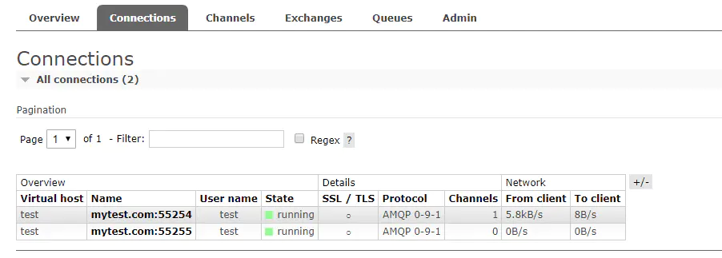

# <p align="center">RabbitMQ 基础配置中文说明文档</p>


本文为官方文档翻译版本 rabbitmq3.7.5版本，原地址：https://github.com/rabbitmq/rabbitmq-server/blob/master/docs/rabbitmq.conf.example。以#开头的行为配置，key和等号以及value之间尽量保持有一个空格。以下的"默认"指的为在没有添加配置文件或者该key没有配置。

## listeners

rabbitmq是使用基于tcp的amqp协议通信(如果需要ssl，可参考[这里](https://www.rabbitmq.com/ssl.html))，所以这里都是监听的tcp的端口。rabbitmq支持监听多端口，并支持指定网卡的ipv4和ipv6。格式为listeners.tcp.${name} = ${value}，name可以是任意不重复的值，如：default、local、local_v6等。value的格式有：

* 1 port 指定端口，那么将会监听所有网卡和本地回环口上的对应的port。
* 2 0.0.0.0:port 指定端口，那么将会监听所有网卡和本地回环口上的对应的ipv4 port。
* 3 :::port 指定端口，那么将会监听所有网卡和本地回环口上的对应的ipv6 port。
* 4 ipv4:port 监听的指定ipv4(网卡)对应的端口。
* 5 ipv6:port 监听的指定ipv6(网卡)对应的端口。
* 6 127.0.0.1:port 监听本地回环口ipv4上对应的地址。
* 7 <p>::1:port 监听本地回环口ipv6上对应的地址。</p>

(1)包括了(2)和(3)，(2)包括了(4)和(6)，(3)包括了(5)和(7)。下面对应的为其中情况的配置，按需求进行配置，不需要都配，大部分情况只配置(1)。默认的配置为listeners.tcp.default = 5672
例:
```
listeners.tcp.default = 5672
listeners.tcp.local_v4 = 127.0.0.1:5673
listeners.tcp.local_v6 = ::1:5673
listeners.tcp.echo_v4 = 172.31.0.14:5674
listeners.tcp.echo_v6 = fe80::f816:3eff:fe5e:93e2:5674
listeners.tcp.all_v4 = 0.0.0.0:5675
listeners.tcp.all_v6 = :::5675
```

## num_acceptors

接受TCP侦听器连接的Erlang进程数。一旦打开了一个使用tcp连接的套接字，它就始终保持打开状态，直至任何一方关闭它或因为一个错误而终止。在建立一个连接时，一般为每一次请求产生一个新进程，num_acceptors就是控制产生新进程的个数。假设有一个监听进程，其任务是等待传入的tcp请求。只要一个请求到达，响应该连接请求的进程就变成了接收进程。默认的配置为num_acceptors.tcp = 10。
例:
```
num_acceptors.tcp = 10
```

## handshake_timeout

AMQP 0-9-1握手（socket连接和TLS握手之后）的最大时间，以毫秒为单位。
默认的配置为handshake_timeout = 10000。
例:
```
handshake_timeout = 10000
```
## reverse_dns_lookups

设置为'true'以在接受一个连接时执行反DNS反查询。 在rabbitmqctl中和web管理中将显示主机名称而不是IP地址。默认的配置为reverse_dns_lookups = true。
例:
```
reverse_dns_lookups = true
```
开启后的效果



## loopback_users

仅允许通过本地（即localhost）连接到代理的用户列表。如果您希望允许guest用户远程连接，则需要将其更改为 loopback_users = none。
要将其他用户限制为仅限localhost的连接，请像这样执行（monitoring是用户的名称）： loopback_users.monitoring = true。默认的配置为loopback_users.guest = true。推荐设置loopback_users.guest = false。
例:
```
loopback_users.guest = false
```

## ssl_options

关于ssl的配置，内容比较多，参考[官网](https://www.rabbitmq.com/ssl.html#enabling-ssl)。默认不配置。

## auth_backends

选择要使用的认证/授权后端。可以配置ldap相关的设置。具体可以参考[access-control](https://www.rabbitmq.com/access-control.html)。internal为由rabbitmq内部处理，默认的配置为 auth_backends.1 = internal。
例:
```
auth_backends.1 = internal
```

## auth_mechanisms

RabbitMQ具有对各种SASL认证机制的可插拔支持。服务器内置了三种这样的机制：PLAIN，AMQPLAIN和RABBIT-CR-DEMO，以及EXTERNAL 可作为[插件使用](https://www.rabbitmq.com/plugins.html)。您还可以通过 在插件中实现rabbit_auth_mechanism行为来实现自己的身份验证机制。有关常规插件开发的更多信息，请参阅[插件开发指南](http://www.rabbitmq.com/plugin-development.html)。默认的配置为PLAIN和AMQPLAIN。
内置的机制：

* PLAIN：这在RabbitMQ服务器和客户端默认启用，并且是大多数其他客户端的默认设置。
* AMQPLAIN：由AMQP 0-8规范定义的PLAIN的非标准版本。这是在RabbitMQ服务器中默认启用的，并且是QPid的Python客户端的默认设置。
* EXTERNAL：使用x509证书对等验证，客户端IP地址范围或类似的带外机制进行身份验证。这种机制通常由RabbitMQ插件提供。
* RABBIT-CR-DEMO：机制具有与PLAIN相同的安全性，在RabbitMQ服务器中未默认启用。

例:
```
auth_mechanisms.1 = PLAIN
auth_mechanisms.2 = AMQPLAIN
auth_mechanisms.3 = EXTERNAL
```

## ssl_cert_login_from

有关rabbitmq-auth-mechanism-ssl插件的配置，查看: https://github.com/rabbitmq/rabbitmq-auth-mechanism-ssl

## ssl_handshake_timeout

SSL handshake超时时间,毫秒为单位。默认的配置为ssl_handshake_timeout = 5000。

例:
```
ssl_handshake_timeout = 5000
```

## password_hashing_module

rabbitmq的用户的密码加密算法。修改该值只会影响新创建的用户，对应老用户需要重置密码进行更新。一般情况下不更改。默认的配置为password_hashing_module = rabbit_password_hashing_sha256。要使用SHA-512，请设置为rabbit_password_hashing_sha512。

例:
```
password_hashing_module = rabbit_password_hashing_sha256
```

## password_hashing_module

和web端的Import definitions、Export definitions有关。好像没啥用==。
```
password_hashing_module = rabbit_password_hashing_md5
```

## Default User / VHost

默认的用户及其权限和vhost。如果一个connect没有配置以下的配置，则使用默认值进行连接。

* default_vhost：vhost，默认为/。
* default_user：用户，默认为guest。
* default_pass：密码，默认为guest。
* default_permissions.configure：权限configure，默认为.*。
* default_permissions.read：权限read ，默认为.*。
* default_permissions.write：权限write，默认为.*。

例:
```
default_vhost = /
default_user = guest
default_pass = guest
default_permissions.configure = .*
default_permissions.read = .*
default_permissions.write = .*
```

## default_user_tags

默认用户的tag。默认的配置default_user_tags.administrator = true。一般不需要改。
例:
```
default_user_tags.administrator = true
```

## heartbeat

heartbeat通常用来检测通信的对端是否存活（未正常关闭socket连接而异常crash）。其基本原理是检测对应的socket连接上数据的收发是否正常，如果一段时间内没有收发数据，则向对端发送一个心跳检测包，如果一段时间内没有回应则认为心跳超时，即认为对端可能异常crash了。
rabbitmq也不例外，heatbeat在客户端和服务端之间用于检测对端是否正常，即客户端与服务端之间的tcp链接是否正常。

heartbeat检测时间间隔的设置：

* 服务端的设置
设置heartbeat，如heartbeat=60，则设置心跳时间为60秒。在3.5.5之前的默认580，之后默认为60s。

* 客户端的设置
根据AMQP协议，rabbitmq会通过connection.tune信令将heartbeat检测时间间隔告知客户端，客户端可以根据需要重新设置该值，并通过Connection.tune-ok信令将时间间隔再告诉给rabbitmq，rabbitmq会以客户端的时间作为该tcp连接上heartbeat检测的间隔时间。
这里要注意的是：如果时间间隔配置为0，则表示不启用heartbeat检测。

例:
```
heartbeat = 60
```

## frame_max

设置amqp协议最大允许的字节数。默认的配置为frame_max = 131072(单位为字节，也就是128k)，注意该值不要设置过大，如果一条消息比较大(如传输文件)，可以通过Publish Confirm和Consumer Acknowledgement机制，如设置过大，那么broker内存会容易被占完。也不要设置过小，保持在128k-1m之间。[引用:使用RabbitMQ传输大文件，保证其完整性](https://blog.csdn.net/tom06/article/details/78133322)
例:
```
frame_max = 131072
```

## initial_frame_max

初始化时的最大字节，不知道哪里使用的。原文：Set the max frame size the server will accept before connection tuning occurs。
例:
```
initial_frame_max = 4096
```

## channel_max

设置每个连接的最大允许通道数量。 0表示“没有限制”。默认的配置为channel_max = 128。
例:
```
channel_max = 128
```

## 19 tcp_listen_options

tcp连接相关的配置。尽量不要改。以下为默认的配置
例:
```
tcp_listen_options.backlog = 128
tcp_listen_options.nodelay = true
tcp_listen_options.exit_on_close = false
tcp_listen_options.keepalive = true
tcp_listen_options.send_timeout = 15000
tcp_listen_options.buffer = 196608
tcp_listen_options.sndbuf = 196608
tcp_listen_options.recbuf = 196608
```

## vm_memory_high_watermark

设置rabbitmq使用内存的阈值。有相对和绝对两种阈值。默认为vm_memory_high_watermark.relative = 0.4。

* relative：默认0.4，为相对于当前服务器总内存的40%。
* absolute ：默认1073741824B，也就是1GB，RabbitMQ >3.6.0也可以KB、MB、GB等单位表示。

>当达到内存和磁盘警报   
>在两种情况下，RabbitMQ将停止从客户端网络套接字读取数据，以防止崩溃。他们是：   
>当[内存使用](http://www.rabbitmq.com/memory-use.html)超过配置的限制时。   
>当磁盘空间低于配置的限制时。   
>在这两种情况下，服务器都会暂时阻止 连接 - 服务器将暂停从发布消息的连接客户端的套接字读取数据。连接心跳监控也将被禁用。所有的网络连接将显示在rabbitmqctl和管理插件作为任何阻挡，这意味着他们并没有试图发布，因此可以继续或 堵塞，这意味着他们已经发布，现在暂停。
>
>在群集中运行RabbitMQ时，内存和磁盘警报是集群范围内的; 如果一个节点超出限制，则所有节点都将阻止连接。   
>
>这里的目的是阻止生产者，但让消费者不受影响。但是，由于AMQP允许生产者和消费者在同一个渠道以及单一连接的不同渠道上运营，这一逻辑必然是不完善的。在实践中，这对大多数应用程序不会造成任何问题，因为节流可以仅仅作为延迟而被观察到。尽管如此，其他设计考虑允许，建议仅使用单独的AMQP连接进行生产或消费。

## vm_memory_high_watermark_paging_ratio

队列开始将消息导出到光盘来释放内存的高水位限制的值。例如，当vm_memory_high_watermark被设置为0.4并且该值被设置为0.5时，可以在节点使用总可用RAM的20％时开始分页。大于1.0的值可能很危险，应谨慎使用。

一种替代方法是使用持久队列并发布消息，作为持久性。 有了这个组合队列将消息更快地移动到磁盘。

另一种方法是配置队列来分页所有消息（都是持久和瞬态）到磁盘。

尽可能参阅http://rabbitmq.com/lazy-queues.html。
例:
```
vm_memory_high_watermark_paging_ratio = 0.5
```

## vm_memory_calculation_strategy

内存使用情况报告策略。可以是以下之一，默认的配置为rss：   
* allocated：使用Erlang内存分配器统计信息
* rss：使用操作系统RSS内存报告。这使用特定于操作系统的手段，并可能启动短暂的子进程。
* legacy：使用legacy内存报告（运行时考虑使用多少内存）。这个策略相当不准确。
* erlang：与legacy相同，为了向后兼容而保留
例:
```
vm_memory_calculation_strategy = rss
```

## memervaory_monitor_intl

根据 watermarks检查内存级别。没发现具体作用。
例:
```
memervaory_monitor_intl = 2500
```

## total_memory_available_override_value

可用内存总量，不使用特定于操作系统的方式从环境中推断内存。 只有当节点可用的实际最大RAM数量与节点将要推断的值不匹配时，才应使用这种方法。 该值可以设置为整数个字节，或者可以以信息单位（例如“8GB”）设置。 例如，当该值设置为4 GB时，该节点会认为它在具有4 GB RAM的计算机上运行。默认不设置该值。
例:
```
total_memory_available_override_value = 2GB
```

## disk_free_limit

和vm_memory_high_watermark类似，disk_free_limit是控制硬盘的使用阈值。RabbitMQ正在存储数据的分区的磁盘可用空间限制。当可用磁盘空间低于此限制时，将触发流量控制。该值可以相对于RAM的总量或以字节或以信息单位表示的绝对值（例如"50MB"或"5GB"或"5KB"）来设置，或者，我们可以设置相对于可用RAM总量的限制。低于1.0的值可能很危险，应谨慎使用。默认为disk_free_limit.absolute = 50MB。
例:
```
disk_free_limit.absolute = 50000
disk_free_limit.absolute = 500KB
disk_free_limit.relative = 2.0
```

## cluster_partition_handling

网络分裂。一种在系统的任何两个组之间的所有网络连接同时发生故障后所出现的情况。发生这种情况时，分裂的系统双方都会从对方一侧重新启动应用程序，进而导致重复服务或裂脑。由网络分裂造成的最为严重的问题是它会影响共享磁盘上的数据。默认为ignore模式。如何处理网络分裂？详细的文档可以参考[官网文档](
http://www.rabbitmq.com/partitions.html#automatic-handling)
可用的模式是：

* ignore：忽略不处理

* pause_minority：暂停少数模式。RabbitMQ在看到其他节点停止后自动处于少数（即少于或等于节点总数的一半）的群集节点。 因此，它从CAP定理中选择对可用性的分裂容差。 这确保了在网络分裂的情况下，单个分裂中的节点最多的将继续运行。 只要分裂开始，少数的节点就会暂停，并在分裂结束时再次启动。

* autoheal：如果分裂被认为已经发生，RabbitMQ将自动决定获胜分裂，并且将重新启动不在获胜分裂中的所有节点。 与pause_minority模式不同，它在分裂结束时生效，而不是在启动时生效。

* pause_if_all_down：暂停全部关闭模式。所有列出的节点都必须关闭以便RabbitMQ暂停群集节点。这接近暂停少数模式，但是，它允许管理员决定选择哪个节点，而不是依赖于上下文。例如，如果集群由机架A中的两个节点和机架B中的两个节点组成，并且机架之间的链路丢失，则暂停少数模式将暂停所有节点。如果管理员在机架A中列出了两个节点，那么在全部停机模式下，只有机架B中的节点才会暂停。请注意，列出的节点可能会在分区的两侧分裂：在这种情况下，没有节点会暂停。这就是为什么有一个额外的ignore / autoheal参数来指示如何从分区中恢复。

>我应该选择哪种模式？
>理解允许RabbitMQ自动处理网络分区不会使它们不成问题很重要。网络分区总是会给RabbitMQ集群带来问题; >你只是在某种程度上选择了你遇到的问题。如前言所述，如果您想通过通常不可靠的链接连接RabbitMQ群集，>则应使用 federation 或者 shovel .
>
>这就是说，你可能希望选择一个恢复模式如下：   
>1）ignore - 你的网络真的很可靠。你所有的节点都在一个机架上，与交换机相连，而且这个交换机也是通向外部世界的路由。如果任何其他部分失败（或者您有两个节点群集），则不希望发生任何群集关闭的风险。
>2）pause_minority - 你的网络可能不太可靠。你在EC2中聚集了3个AZ，并且你认为只有一个AZ会一次失>败。在这种情况下，您希望剩余的两个AZ继续工作，并且失败的AZ中的节点在AZ返回时自动重新加入，而不会大惊小怪。
>3）autoheal - 您的网络可能不可靠。与数据完整性相比，您更关心服务的连续性。您可能有两个节点群集。

## mirroring_sync_batch_size

在消息中镜像同步批量大小。增加这将加快同步，但批量总大小（以字节为单位）不得超过2 GiB。该设置可用于RabbitMQ 3.6.0或更高版本。默认的配置为 mirroring_sync_batch_size = 4096(4k)。
例:
```
mirroring_sync_batch_size = 4096
```

## cluster_formation

集群相关的配置，为了形成一个集群，新的（“空白”）节点需要能够发现他们的同伴。这可以使用各种机制（后端）来完成。有些机制假定所有集群成员都提前知道（例如，在配置文件中列出），其他机制是动态的（节点可以动态增删）。
内置的发现机制如下:

* Config file：配置文件，peer_discovery_backend=rabbit_peer_discovery_classic_config，配置节点cluster_formation.classic_config.nodes.1 = rabbit1@hostname。

* DNS：DNS进行发现，它依靠DNS A（或AAAA）记录和反向DNS查找的预配置主机名。cluster_formation.peer_discovery_backend = rabbit_peer_discovery_dns，配置dns对应的主机名
cluster_formation.dns.hostname = discovery.eng.example.local

cluster_formation.node_type：节点类型。默认为disc。   
cluster_keepalive_interval：像集群里的其他子节点发送存活消息的间隔(毫秒)。默认为cluster_keepalive_interval = 10000

## collect_statistics

统计相关，与web管理插件显示有关。可配置的值如下：

* none：不统计。
* coarse：统计 per-queue、per-channel、per-connection 的事件。
* fine：统计 per-queue、per-channel、per-connection、per-message 的事件。

collect_statistics_interval 配置发送当前broker的时间间隔，单位毫秒。默认的配置为collect_statistics = fine，collect_statistics_interval = 5000。
例:
```
collect_statistics = fine
collect_statistics_interval = 5000
```

## hipe_compile

设置为true，以便使用HiPE预编译RabbitMQ的部分，这是Erlang的即时编译器。 这会以增加启动时间为代价来提高服务器吞吐量。   
您可能会看到启动时延迟几分钟的成本提高20-50％。 这些数据非常依赖于工作负载和硬件。
HiPE支持可能不会编译到您的Erlang安装中。 如果不是，启用此选项只会导致显示一条警告消息，启动将按正常进行。 例如，Debian / Ubuntu用户需要安装erlang-base-hipe软件包。

HiPE在某些平台上完全不可用，特别包括Windows。

HiPE在17.5之前的Erlang / OTP版本中存在已知问题。 HiPE强烈建议使用最新的Erlang / OTP版本。默认的配置为hipe_compile = false。

## mnesia_table_loading_retry_timeout

等待集群中的Mnesia tables变得可用时使用的超时。默认的配置mnesia_table_loading_retry_timeout = 30000。

## mnesia_table_loading_retry_limit

在等待集群中的Mnesia tables可用时，需要重试的次数。默认的配置mnesia_table_loading_retry_limit = 10。

## queue_index_embed_msgs_below

在消息的字节数中，消息将被直接嵌入到队列索引中。详情请看 [persister tuning](http://www.rabbitmq.com/persistence-conf.html)。默认的配置queue_index_embed_msgs_below = 4096。

## background_gc_enabled

是否启用后台定期强制GC为“等待”状态运行节点上的所有Erlang进程。
禁用后台GC可以减少客户端操作的延迟，保持启用状态可以减少二进制堆的RAM使用量（请参阅https://www.erlang-solutions.com/blog/erlang-garbage-collector.html）。
在尝试此选项之前，请查看内存（http://www.rabbitmq.com/memory-use.html）。
默认的配置background_gc_enabled = false，当配置为true时，可以设置gc的间隔，默认的配置为background_gc_target_interval = 60000(毫秒)。

## proxy_protocol

设置是否启用代理，启用后不能直连到broker。默认的配置proxy_protocol = false。

## net_ticktime

未知

## management

有关web管理后台的配置。

* management.load_definitions： 配置启动web后台的时候的加载的配置，如：management.load_definitions = /path/to/exported/definitions.json。默认不配置。

* management.http_log_dir ： 配置启动web后台运行日志目录，如：management.http_log_dir = /path/to/access.log。默认不配置。

* management.listener ： 配置启动web后台监听的端口，如：management.listener.port = 15672。默认15672。
* management.listener.ssl ： web后台启用https，如：management.load_definitions = /path/to/access.log。默认不配置。默认为false。如果为true，则需要进行下面配置：

```
management.listener.ssl_opts.cacertfile = /path/to/cacert.pem
management.listener.ssl_opts.certfile   = /path/to/cert.pem
management.listener.ssl_opts.keyfile    = /path/to/key.pem
```
* management.http_log_dir ： 配置启动web后台的时候的加载的配置，如：management.load_definitions = /path/to/access.log。默认不配置。

* management.rates_mode：消息速率，默认为basic。一般不需要改。

* management.sample_retention_policies：web管理后台将保留一些数据的样本，如消息速率和队列长度。 可以配置保留这些数据的时间。
```
management.sample_retention_policies.global.minute  = 5
management.sample_retention_policies.global.hour    = 60
management.sample_retention_policies.global.day = 1200

management.sample_retention_policies.basic.minute = 5
management.sample_retention_policies.basic.hour   = 60

management.sample_retention_policies.detailed.10 = 5
```

有下面三个策略
* global - 保留概览和虚拟主机页面的数据需要多长时间
* basic - 为各个连接，通道，交换和队列保留数据需要多长时间
* detailed - 保留连接，通道，交换和队列对之间的消息速率数据的时间（如“消息速率细分”所示）。

此配置（默认设置）以5秒的分辨率（每5秒钟采样一次）保留全局数据10分钟和5秒，然后以1分钟的分辨率保存1小时1分钟，然后以10分钟的分辨率 大约8个小时。 它以5秒的分辨率保存1分钟和5秒的基本数据，然后以1分钟的分辨率保存1小时，详细的数据仅保留10秒。 所有这三项策略都是强制性的，并且必须至少包含一个保留对{MaxAgeInSeconds，SampleEveryNSeconds}。

## stom

查看http://www.rabbitmq.com/stomp.html。

## mqtt

查看http://www.rabbitmq.com/mqtt.html

## amqp1.0

查看https://github.com/rabbitmq/rabbitmq-amqp1.0

## ldap

查看http://rabbitmq.com/ldap.html。

