# redis-01

<!-- MarkdownTOC -->

- [1. redis常用操作命令](#1)
  - [String](#1.1)
  - [List](#1.2)
  - [Hash](#1.3)
  - [Set](#1.4)
  - [sorted set](#1.5)
  - [1.6 Redis 键(key)](#1.6)
- [2. 解析配置文件redis.conf](#2)
  - [2.1 启动redis服务](#2.1)
    - [2.1.1 Redis启动后杂项基础知识讲解](#2.1.1)
  - [2.2 units](#2.2)
  - [2.3 INCLUDES](#2.3)
  - [2.4 GENERAL](#2.4)
  - [2.5 SNAPSHOTTING](#2.5)
  - [2.6 REPLICATION](#2.6)
  - [2.7 SECURITY](#2.7)
  - [2.8 MEMORY MANAGEMENT](#2.8)
  - [2.9 APPEND ONLY MODE](#2.9)
  - [2.10 常见配置redis.conf介绍](#2.10)
- [3. redis的持久化](#3)
  - [3.1 总体介绍](#3.1)
  - [3.2 RDB(Redis DataBase)](#3.2)
    - [3.2.1 官网介绍](#3.2.1)
    - [3.2.2 是什么？](#3.2.2)
    - [3.2.3 如何触发RDB快照](#3.2.3)
    - [3.2.4 如何恢复？如何停止？](#3.2.4)
    - [3.2.5 优势、劣势](#3.2.5)
    - [3.2.6 小结](#3.2.6)
  - [3.3 AOF(Append Only File)](#3.3)
    - [3.3.1 官网介绍](#3.3.1)
    - [3.3.2 是什么？](#3.3.2)
    - [3.3.3 AOF启动/修复/恢复](#3.3.3)
    - [3.3.4 rewrite](#3.3.4)
    - [3.3.5 优势、劣势](#3.3.5)
    - [3.3.6 小结](#3.3.6)
- [4. Redis的事务](#4)
  - [4.1 是什么？](#4.1)
  - [4.2 能干嘛？](#4.2)
  - [4.3 怎么玩？](#4.3)
    - [4.3.1 常用命令](#4.3.1)
    - [4.3.2 CASE](#4.3.2)
  - [4.4 三阶段](#4.4)
  - [4.5 三特性](#4.5)
- [5. Redis的发布订阅](#5)
  - [5.1 是什么？](#5.1)
  - [5.2 命令](#5.2)
  - [5.3 案列](#5.3)
- [6. Redis Replication](#6)
  - [6.1 是什么？](#6.1)
  - [6.2 能干嘛？](#6.2)
  - [6.3 怎么玩？](#6.3)
  - [6.4 复制原理](#6.4)
  - [6.5 哨兵模式(sentinel)](#6.5)
    - [6.5.1 是什么？](#6.5.1)
    - [6.5.2 怎么玩(使用步骤)？](#6.5.2)
  - [6.6 复制的缺点](#6.6)
   
  


  
  
  
  
  
  
  
<!-- /MarkdownTOC -->

<h1 id="1">1. redis常用操作命令</h1>

<h2 id="1.1">1.1 String</h2>

|  C  |  R  |  U  |  D  |
| :--------   | :--------   |  :--------   | :--------   |
|SET key value|GET key|GETSET key value|  |
|MSET key value [key value ...]|MGET key1 [key2..]|SETBIT key offset value|  |
|MSETNX key value [key value ...]|GETRANGE key start end|SETRANGE key offset value|  |
|SETNX key value|STRLEN key|PSETEX key milliseconds value|  |
|SETEX key seconds value|GETBIT key offset|INCR key|  |
|  |  |INCRBY key increment|  |
|  |  |INCRBYFLOAT key increment|  |
|  |  |DECR key|  |
|  |  |DECRBY key decrementkey|  |
|  |  |APPEND key value|  |  |


<h2 id="1.2">1.2 List</h2>

|  C  |  R  |  U  |  D  |
| :--------   | :--------   |  :--------   | :--------   |
|LPUSHX key value|LINDEX key index|LSET key index value|LPOP key|
|RPUSH key value1 [value2]|LLEN key|LTRIM key start stop|RPOP key|
|LPUSHX key value|LRANGE key start stop|  |BLPOP key1 [key2 ] timeout|
|RPUSHX key value|  |  |BRPOP key1 [key2 ] timeout|
|LINSERT key BEFORE/AFTER pivot value|  |  |BRPOPLPUSH source destination timeout|
|  |  |  |RPOPLPUSH source destination|
|  |  |  |LREM key count value|

<h2 id="1.3">1.3 Hash</h2>

|  C  |  R  |  U  |  D  |
| :--------   | :--------   |  :--------   | :--------   |
|HMSET key field1 value1 [field2 value2 ]|HEXISTS key field|HINCRBY key field increment|HDEL key field1 [field2]|
|HSET key field value|HGET key field|HINCRBYFLOAT key field increment|  |
|HSETNX key field value|HMGET key field1 [field2]|  |  |
|  |HGETALL key|  |  |
|  |HKEYS key|  |  |
|  |HVALS key|  |  |
|  |HLEN key|  |  |
|  |HSCAN key cursor [MATCH pattern] [COUNT count]|  |  |  |


<h2 id="1.4">1.4 Set</h2>

|  C  |  R  |  U  |  D  |
| :--------   | :--------   |  :--------   | :--------   |
|SADD key member1 [member2]|SCARD key|SDIFFSTORE destination key1 [key2]|SMOVE source destination |
|  |SDIFF key1 [key2]|SINTERSTORE destination key1 [key2]|SPOP key|
|  |SINTER key1 [key2]|SUNIONSTORE destination key1 [key2]|SREM key member1 [member2]|
|  |SISMEMBER key member|  |  |
|  |SMEMBERS key|  |  |
|  |SRANDMEMBER key [count]|  |  |
|  |SUNION key1 [key2]|  |  |
|  |SSCAN key cursor [MATCH pattern] [COUNT count]|  |  |


<h2 id="1.5">1.5 sorted set</h2>

|  C  |  R  |  U  |  D  |
| :--------   | :--------   |  :--------   | :--------   |
|ZADD key score1 member1 [score2 member2]|ZCARD key|ZINCRBY key increment member|ZREM key member [member ...]|
|  |ZCOUNT key min max|ZINTERSTORE destination numkeys key [key ...]|ZREMRANGEBYLEX key min max|
|  |ZLEXCOUNT key min max|ZUNIONSTORE destination numkeys key [key ...]|ZREMRANGEBYRANK key start stop|
|  |ZRANGE key start stop [WITHSCORES]|  |	ZREMRANGEBYSCORE key min max|
|  |ZRANGEBYLEX key min max [LIMIT offset count]|  |  |
|  |ZRANGEBYSCORE key min max [WITHSCORES] [LIMIT]|  |  |
|  |ZRANK key member|  |  |
|  |ZREVRANGE key start stop [WITHSCORES]|  |  |
|  |ZREVRANGEBYSCORE key max min [WITHSCORES]|  |  |
|  |ZREVRANK key member|  |  |
|  |ZSCORE key member|  |  |
|  |ZSCAN key cursor [MATCH pattern] [COUNT count]|  |  |


<h2 id="1.6">1.6 Redis 键(key)</h2>

| 命令        | 描述   |
| :-------- | :----- |
|  DEL key  |  该命令用于在 key 存在时删除 key。  |
|  DUMP key  |  序列化给定 key ，并返回被序列化的值。  |
|  EXISTS key  |  检查给定 key 是否存在。  |
|  EXPIRE key seconds  |  为给定 key 设置过期时间，以秒计。  |
|  EXPIREAT key timestamp  |  EXPIREAT 的作用和 EXPIRE 类似，都用于为 key 设置过期时间。 不同在于 EXPIREAT 命令接受的时间参数是 UNIX 时间戳(unix timestamp)。  |
|  PEXPIRE key milliseconds  |  设置 key 的过期时间以毫秒计。  |
|  PEXPIREAT key milliseconds-timestamp  |  设置 key 过期时间的时间戳(unix timestamp) 以毫秒计。  |
|  KEYS pattern  |  查找所有符合给定模式( pattern)的 key 。  |
|  MOVE key db  |  将当前数据库的 key 移动到给定的数据库 db 当中。  |
|  PERSIST key  |  移除 key 的过期时间，key 将持久保持。  |
|  PTTL key  |  以毫秒为单位返回 key 的剩余的过期时间。  |
|  TTL key  |  以秒为单位，返回给定 key 的剩余生存时间(TTL, time to live)。  |
|  RANDOMKEY  |  从当前数据库中随机返回一个 key 。  |
|  RENAME key newkey  |  修改 key 的名称。  |
|  RENAMENX key newkey  |  仅当 newkey 不存在时，将 key 改名为 newkey 。  |
|  TYPE key  |  返回 key 所储存的值的类型。  |


---
<h1 id="2">2. 解析配置文件redis.conf</h1>

---

<h2 id="2.1">2.1 启动redis服务</h2>

```
# Note that in order to read the configuration file, Redis must be
# started with the file path as first argument:
#
# ./redis-server /path/to/redis.conf

```

* 配置文件路径  
```
/opt/redis-5.0.7/redis.conf
```

* redis安装路径   
```
/usr/local/redis/5.0.7/bin
```

* 启动服务   
```
./redis-server /opt/redis-5.0.7/redis.conf
```

以上路径会由于安装或存放，存在差异，仅供参考。

<h3 id="2.1.1">2.1.1 Redis启动后杂项基础知识讲解</h3>

* 单进程   
单进程模型来处理客户端的请求。对读写等事件的响应是通过对epoll函数的包装来做到的。Redis的实际处理速度完全依靠主进程的执行效率。
epoll是Linux内核为处理大批量文件描述符而作了改进的epoll，是Linux下多路复用IO接口select/poll的增强版本，
它能显著提高程序在大量并发连接中只有少量活跃的情况下的系统CPU利用率。
* 默认16个数据库，类似数组下标从0开始，初始默认使用0号库。可以使用 `SELECT <dbid>` 命令在连接上指定数据库id
* select命令切换数据库
* dbsize查看当前数据库的key的数量
* `flushdb` 清空当前库
* `flushall` 通杀全部库
* 统一密码管理，16个库都是同样密码，要么都OK要么一个也连接不上
* Redis索引都是从零开始
* 为什么默认端口是6379？


<h2 id="2.2">2.2 units</h2>

```
# Note on units: when memory size is needed, it is possible to specify
# it in the usual form of 1k 5GB 4M and so forth:
#
# 1k => 1000 bytes
# 1kb => 1024 bytes
# 1m => 1000000 bytes
# 1mb => 1024*1024 bytes
# 1g => 1000000000 bytes
# 1gb => 1024*1024*1024 bytes
#
# units are case insensitive so 1GB 1Gb 1gB are all the same.

```   
1. 配置大小单位,开头定义了一些基本的度量单位，只支持bytes，不支持bit   
2. 对大小写不敏感


<h2 id="2.3">2.3 INCLUDES</h2>

```
################################## INCLUDES ###################################

# Include one or more other config files here.  This is useful if you
# have a standard template that goes to all Redis servers but also need
# to customize a few per-server settings.  Include files can include
# other files, so use this wisely.
#
# Notice option "include" won't be rewritten by command "CONFIG REWRITE"
# from admin or Redis Sentinel. Since Redis always uses the last processed
# line as value of a configuration directive, you'd better put includes
# at the beginning of this file to avoid overwriting config change at runtime.
#
# If instead you are interested in using includes to override configuration
# options, it is better to use include as the last line.
#
# include /path/to/local.conf
# include /path/to/other.conf

```   
和我们的Struts2配置文件类似，可以通过includes包含，redis.conf可以作为总闸，包含其他

<h2 id="2.4">2.4 GENERAL</h2>

```
################################# GENERAL #####################################

# By default Redis does not run as a daemon. Use 'yes' if you need it.
# Note that Redis will write a pid file in /var/run/redis.pid when daemonized.
daemonize no

# If you run Redis from upstart or systemd, Redis can interact with your
# supervision tree. Options:
#   supervised no      - no supervision interaction
#   supervised upstart - signal upstart by putting Redis into SIGSTOP mode
#   supervised systemd - signal systemd by writing READY=1 to $NOTIFY_SOCKET
#   supervised auto    - detect upstart or systemd method based on
#                        UPSTART_JOB or NOTIFY_SOCKET environment variables
# Note: these supervision methods only signal "process is ready."
#       They do not enable continuous liveness pings back to your supervisor.
supervised no

# If a pid file is specified, Redis writes it where specified at startup
# and removes it at exit.
#
# When the server runs non daemonized, no pid file is created if none is
# specified in the configuration. When the server is daemonized, the pid file
# is used even if not specified, defaulting to "/var/run/redis.pid".
#
# Creating a pid file is best effort: if Redis is not able to create it
# nothing bad happens, the server will start and run normally.
pidfile /var/run/redis_6379.pid

# Specify the server verbosity level.
# This can be one of:
# debug (a lot of information, useful for development/testing)
# verbose (many rarely useful info, but not a mess like the debug level)
# notice (moderately verbose, what you want in production probably)
# warning (only very important / critical messages are logged)
loglevel notice

# Specify the log file name. Also the empty string can be used to force
# Redis to log on the standard output. Note that if you use standard
# output for logging but daemonize, logs will be sent to /dev/null
logfile ""

# To enable logging to the system logger, just set 'syslog-enabled' to yes,
# and optionally update the other syslog parameters to suit your needs.
# syslog-enabled no

# Specify the syslog identity.
# syslog-ident redis

# Specify the syslog facility. Must be USER or between LOCAL0-LOCAL7.
# syslog-facility local0

# Set the number of databases. The default database is DB 0, you can select
# a different one on a per-connection basis using SELECT <dbid> where
# dbid is a number between 0 and 'databases'-1
databases 16

# By default Redis shows an ASCII art logo only when started to log to the
# standard output and if the standard output is a TTY. Basically this means
# that normally a logo is displayed only in interactive sessions.
#
# However it is possible to force the pre-4.0 behavior and always show a
# ASCII art logo in startup logs by setting the following option to yes.
always-show-logo yes

```   
* **daemonize**   
* **pidfile**   
* **port**   
* **tcp-backlog**   
设置tcp的backlog，backlog其实是一个连接队列，backlog队列总和=未完成三次握手队列 + 已经完成三次握手队列。
在高并发环境下你需要一个高backlog值来避免慢客户端连接问题。注意Linux内核会将这个值减小到/proc/sys/net/core/somaxconn的值，所以需要确认增大somaxconn和tcp_max_syn_backlog两个值来达到想要的效果。   
* **timeout**   
* **bind**    
* **tcp-keepalive**   
单位为秒，如果设置为0，则不会进行Keepalive检测，建议设置成60    
* **loglevel**   
* **logfile**   
* **syslog-enabled**   
是否把日志输出到syslog中   
* **syslog-ident**   
指定syslog里的日志标志   
* **syslog-facility**   
指定syslog设备，值可以是USER或LOCAL0-LOCAL7   
* **databases**


<h2 id="2.5">2.5 SNAPSHOTTING</h2>

```
################################ SNAPSHOTTING  ################################
#
# Save the DB on disk:
#
#   save <seconds> <changes>
#
#   Will save the DB if both the given number of seconds and the given
#   number of write operations against the DB occurred.
#
#   In the example below the behaviour will be to save:
#   after 900 sec (15 min) if at least 1 key changed
#   after 300 sec (5 min) if at least 10 keys changed
#   after 60 sec if at least 10000 keys changed
#
#   Note: you can disable saving completely by commenting out all "save" lines.
#
#   It is also possible to remove all the previously configured save
#   points by adding a save directive with a single empty string argument
#   like in the following example:
#
#   save ""

save 900 1
save 300 10
save 60 10000

# By default Redis will stop accepting writes if RDB snapshots are enabled
# (at least one save point) and the latest background save failed.
# This will make the user aware (in a hard way) that data is not persisting
# on disk properly, otherwise chances are that no one will notice and some
# disaster will happen.
#
# If the background saving process will start working again Redis will
# automatically allow writes again.
#
# However if you have setup your proper monitoring of the Redis server
# and persistence, you may want to disable this feature so that Redis will
# continue to work as usual even if there are problems with disk,
# permissions, and so forth.
stop-writes-on-bgsave-error yes

# Compress string objects using LZF when dump .rdb databases?
# For default that's set to 'yes' as it's almost always a win.
# If you want to save some CPU in the saving child set it to 'no' but
# the dataset will likely be bigger if you have compressible values or keys.
rdbcompression yes

# Since version 5 of RDB a CRC64 checksum is placed at the end of the file.
# This makes the format more resistant to corruption but there is a performance
# hit to pay (around 10%) when saving and loading RDB files, so you can disable it
# for maximum performances.
#
# RDB files created with checksum disabled have a checksum of zero that will
# tell the loading code to skip the check.
rdbchecksum yes

# The filename where to dump the DB
dbfilename dump.rdb

# The working directory.
#
# The DB will be written inside this directory, with the filename specified
# above using the 'dbfilename' configuration directive.
#
# The Append Only File will also be created inside this directory.
#
# Note that you must specify a directory here, not a file name.
dir ./

```   

* **save**   
save 秒钟 写操作次数   
RDB是整个内存的压缩过的Snapshot，RDB的数据结构，可以配置复合的快照触发条件。   
默认：是1分钟内改了1万次，或5分钟内改了10次，或15分钟内改了1次。
禁用：如果想禁用RDB持久化的策略，只要不设置任何save指令，或者给save传入一个空字符串参数也可以   
* **stop-writes-on-bgsave-error**   
如果配置成no，表示你不在乎数据不一致或者有其他的手段发现和控制
* **rdbcompression**   
对于存储到磁盘中的快照，可以设置是否进行压缩存储。如果是的话，redis会采用LZF算法进行压缩。如果你不想消耗CPU来进行压缩的话，可以设置为关闭此功能。   
* **rdbchecksum**   
在存储快照后，还可以让redis使用CRC64算法来进行数据校验，但是这样做会增加大约10%的性能消耗，如果希望获取到最大的性能提升，可以关闭此功能。   
* **dbfilename**   
* **dir**   


<h2 id="2.6">2.6 REPLICATION</h2>

```
################################# REPLICATION #################################

# Master-Replica replication. Use replicaof to make a Redis instance a copy of
# another Redis server. A few things to understand ASAP about Redis replication.
#
#   +------------------+      +---------------+
#   |      Master      | ---> |    Replica    |
#   | (receive writes) |      |  (exact copy) |
#   +------------------+      +---------------+
#
# 1) Redis replication is asynchronous, but you can configure a master to
#    stop accepting writes if it appears to be not connected with at least
#    a given number of replicas.
# 2) Redis replicas are able to perform a partial resynchronization with the
#    master if the replication link is lost for a relatively small amount of
#    time. You may want to configure the replication backlog size (see the next
#    sections of this file) with a sensible value depending on your needs.
# 3) Replication is automatic and does not need user intervention. After a
#    network partition replicas automatically try to reconnect to masters
#    and resynchronize with them.
#
# replicaof <masterip> <masterport>

# If the master is password protected (using the "requirepass" configuration
# directive below) it is possible to tell the replica to authenticate before
# starting the replication synchronization process, otherwise the master will
# refuse the replica request.
#
# masterauth <master-password>

# When a replica loses its connection with the master, or when the replication
# is still in progress, the replica can act in two different ways:
#
# 1) if replica-serve-stale-data is set to 'yes' (the default) the replica will
#    still reply to client requests, possibly with out of date data, or the
#    data set may just be empty if this is the first synchronization.
#
# 2) if replica-serve-stale-data is set to 'no' the replica will reply with
#    an error "SYNC with master in progress" to all the kind of commands
#    but to INFO, replicaOF, AUTH, PING, SHUTDOWN, REPLCONF, ROLE, CONFIG,
#    SUBSCRIBE, UNSUBSCRIBE, PSUBSCRIBE, PUNSUBSCRIBE, PUBLISH, PUBSUB,
#    COMMAND, POST, HOST: and LATENCY.
#
replica-serve-stale-data yes

# You can configure a replica instance to accept writes or not. Writing against
# a replica instance may be useful to store some ephemeral data (because data
# written on a replica will be easily deleted after resync with the master) but
# may also cause problems if clients are writing to it because of a
# misconfiguration.
#
# Since Redis 2.6 by default replicas are read-only.
#
# Note: read only replicas are not designed to be exposed to untrusted clients
# on the internet. It's just a protection layer against misuse of the instance.
# Still a read only replica exports by default all the administrative commands
# such as CONFIG, DEBUG, and so forth. To a limited extent you can improve
# security of read only replicas using 'rename-command' to shadow all the
# administrative / dangerous commands.
replica-read-only yes

# Replication SYNC strategy: disk or socket.
#
# -------------------------------------------------------
# WARNING: DISKLESS REPLICATION IS EXPERIMENTAL CURRENTLY
# -------------------------------------------------------
#
# New replicas and reconnecting replicas that are not able to continue the replication
# process just receiving differences, need to do what is called a "full
# synchronization". An RDB file is transmitted from the master to the replicas.
# The transmission can happen in two different ways:
#
# 1) Disk-backed: The Redis master creates a new process that writes the RDB
#                 file on disk. Later the file is transferred by the parent
#                 process to the replicas incrementally.
# 2) Diskless: The Redis master creates a new process that directly writes the
#              RDB file to replica sockets, without touching the disk at all.
#
# With disk-backed replication, while the RDB file is generated, more replicas.
# The transmission can happen in two different ways:
#
# 1) Disk-backed: The Redis master creates a new process that writes the RDB
#                 file on disk. Later the file is transferred by the parent
#                 process to the replicas incrementally.
# 2) Diskless: The Redis master creates a new process that directly writes the
#              RDB file to replica sockets, without touching the disk at all.
#
# With disk-backed replication, while the RDB file is generated, more replicas
# can be queued and served with the RDB file as soon as the current child producing
# the RDB file finishes its work. With diskless replication instead once
# the transfer starts, new replicas arriving will be queued and a new transfer
# will start when the current one terminates.
#
# When diskless replication is used, the master waits a configurable amount of
# time (in seconds) before starting the transfer in the hope that multiple replicas
# will arrive and the transfer can be parallelized.
#
# With slow disks and fast (large bandwidth) networks, diskless replication
# works better.
repl-diskless-sync no

# When diskless replication is enabled, it is possible to configure the delay
# the server waits in order to spawn the child that transfers the RDB via socket
# to the replicas.
#
# This is important since once the transfer starts, it is not possible to serve
# new replicas arriving, that will be queued for the next RDB transfer, so the server
# waits a delay in order to let more replicas arrive.
#
# The delay is specified in seconds, and by default is 5 seconds. To disable
# it entirely just set it to 0 seconds and the transfer will start ASAP.
repl-diskless-sync-delay 5

# Replicas send PINGs to server in a predefined interval. It's possible to change
# this interval with the repl_ping_replica_period option. The default value is 10
# seconds.
#
# repl-ping-replica-period 10

# The following option sets the replication timeout for:
#
# 1) Bulk transfer I/O during SYNC, from the point of view of replica.
# 2) Master timeout from the point of view of replicas (data, pings).
# 3) Replica timeout from the point of view of masters (REPLCONF ACK pings).
#
# It is important to make sure that this value is greater than the value
# specified for repl-ping-replica-period otherwise a timeout will be detected
# every time there is low traffic between the master and the replica.
#
# repl-timeout 60

# Disable TCP_NODELAY on the replica socket after SYNC?
#
# If you select "yes" Redis will use a smaller number of TCP packets and
# less bandwidth to send data to replicas. But this can add a delay for
# the data to appear on the replica side, up to 40 milliseconds with
# Linux kernels using a default configuration.
#
# If you select "no" the delay for data to appear on the replica side will
# be reduced but more bandwidth will be used for replication.
#
# By default we optimize for low latency, but in very high traffic conditions
# or when the master and replicas are many hops away, turning this to "yes" may
# be a good idea.
repl-disable-tcp-nodelay no

# Set the replication backlog size. The backlog is a buffer that accumulates
# replica data when replicas are disconnected for some time, so that when a replica
# wants to reconnect again, often a full resync is not needed, but a partial
# resync is enough, just passing the portion of data the replica missed while
# disconnected.
#
# The bigger the replication backlog, the longer the time the replica can be
# disconnected and later be able to perform a partial resynchronization.
#
# The backlog is only allocated once there is at least a replica connected.
#
# repl-backlog-size 1mb

# After a master has no longer connected replicas for some time, the backlog
# will be freed. The following option configures the amount of seconds that
# need to elapse, starting from the time the last replica disconnected, for
# the backlog buffer to be freed.
#
# Note that replicas never free the backlog for timeout, since they may be
# promoted to masters later, and should be able to correctly "partially
# resynchronize" with the replicas: hence they should always accumulate backlog.
#
# A value of 0 means to never release the backlog.
#
# repl-backlog-ttl 3600

# The replica priority is an integer number published by Redis in the INFO output.
# It is used by Redis Sentinel in order to select a replica to promote into a
# master if the master is no longer working correctly.
#
# A replica with a low priority number is considered better for promotion, so
# for instance if there are three replicas with priority 10, 100, 25 Sentinel will
# pick the one with priority 10, that is the lowest.
#
# However a special priority of 0 marks the replica as not able to perform the
# role of master, so a replica with priority of 0 will never be selected by
# Redis Sentinel for promotion.
#
# By default the priority is 100.
replica-priority 100

# It is possible for a master to stop accepting writes if there are less than
# N replicas connected, having a lag less or equal than M seconds.
#
# The N replicas need to be in "online" state.
#
# The lag in seconds, that must be <= the specified value, is calculated from
# the last ping received from the replica, that is usually sent every second.
#
# This option does not GUARANTEE that N replicas will accept the write, but
# will limit the window of exposure for lost writes in case not enough replicas
# are available, to the specified number of seconds.
#
# For example to require at least 3 replicas with a lag <= 10 seconds use:
#
# min-replicas-to-write 3
# min-replicas-max-lag 10
#
# Setting one or the other to 0 disables the feature.
#
# By default min-replicas-to-write is set to 0 (feature disabled) and
# min-replicas-max-lag is set to 10.

# A Redis master is able to list the address and port of the attached
# replicas in different ways. For example the "INFO replication" section
# offers this information, which is used, among other tools, by
# Redis Sentinel in order to discover replica instances.
# Another place where this info is available is in the output of the
# "ROLE" command of a master.
#
# The listed IP and address normally reported by a replica is obtained
# in the following way:
#
#   IP: The address is auto detected by checking the peer address
#   of the socket used by the replica to connect with the master.
#
#   Port: The port is communicated by the replica during the replication
#   handshake, and is normally the port that the replica is using to
#   listen for connections.
#
# However when port forwarding or Network Address Translation (NAT) is
# used, the replica may be actually reachable via different IP and port
# pairs. The following two options can be used by a replica in order to
# report to its master a specific set of IP and port, so that both INFO
# and ROLE will report those values.
#
# There is no need to use both the options if you need to override just
# the port or the IP address.
#
# replica-announce-ip 5.5.5.5
# replica-announce-port 1234

```

<h2 id="2.7">2.7 SECURITY</h2>

```
################################## SECURITY ###################################

# Require clients to issue AUTH <PASSWORD> before processing any other
# commands.  This might be useful in environments in which you do not trust
# others with access to the host running redis-server.
#
# This should stay commented out for backward compatibility and because most
# people do not need auth (e.g. they run their own servers).
#
# Warning: since Redis is pretty fast an outside user can try up to
# 150k passwords per second against a good box. This means that you should
# use a very strong password otherwise it will be very easy to break.
#
# requirepass foobared

# Command renaming.
#
# It is possible to change the name of dangerous commands in a shared
# environment. For instance the CONFIG command may be renamed into something
# hard to guess so that it will still be available for internal-use tools
# but not available for general clients.
#
# Example:
#
# rename-command CONFIG b840fc02d524045429941cc15f59e41cb7be6c52
#
# It is also possible to completely kill a command by renaming it into
# an empty string:
#
# rename-command CONFIG ""
#
# Please note that changing the name of commands that are logged into the
# AOF file or transmitted to replicas may cause problems.

```   
访问密码的查看、设置和取消

<h2 id="2.8">2.8 MEMORY MANAGEMENT</h2>

```
############################## MEMORY MANAGEMENT ################################

# Set a memory usage limit to the specified amount of bytes.
# When the memory limit is reached Redis will try to remove keys
# according to the eviction policy selected (see maxmemory-policy).
#
# If Redis can't remove keys according to the policy, or if the policy is
# set to 'noeviction', Redis will start to reply with errors to commands
# that would use more memory, like SET, LPUSH, and so on, and will continue
# to reply to read-only commands like GET.
#
# This option is usually useful when using Redis as an LRU or LFU cache, or to
# set a hard memory limit for an instance (using the 'noeviction' policy).
#
# WARNING: If you have replicas attached to an instance with maxmemory on,
# the size of the output buffers needed to feed the replicas are subtracted
# from the used memory count, so that network problems / resyncs will
# not trigger a loop where keys are evicted, and in turn the output
# buffer of replicas is full with DELs of keys evicted triggering the deletion
# of more keys, and so forth until the database is completely emptied.
#
# In short... if you have replicas attached it is suggested that you set a lower
# limit for maxmemory so that there is some free RAM on the system for replica
# output buffers (but this is not needed if the policy is 'noeviction').
#
# maxmemory <bytes>

# MAXMEMORY POLICY: how Redis will select what to remove when maxmemory
# is reached. You can select among five behaviors:
#
# volatile-lru -> Evict using approximated LRU among the keys with an expire set.
# allkeys-lru -> Evict any key using approximated LRU.
# volatile-lfu -> Evict using approximated LFU among the keys with an expire set.
# allkeys-lfu -> Evict any key using approximated LFU.
# volatile-random -> Remove a random key among the ones with an expire set.
# allkeys-random -> Remove a random key, any key.
# volatile-ttl -> Remove the key with the nearest expire time (minor TTL)
# noeviction -> Don't evict anything, just return an error on write operations.
#
# LRU means Least Recently Used
# LFU means Least Frequently Used
#
# Both LRU, LFU and volatile-ttl are implemented using approximated
# randomized algorithms.
#
# Note: with any of the above policies, Redis will return an error on write
#       operations, when there are no suitable keys for eviction.
#
#       At the date of writing these commands are: set setnx setex append
#       incr decr rpush lpush rpushx lpushx linsert lset rpoplpush sadd
#       sinter sinterstore sunion sunionstore sdiff sdiffstore zadd zincrby
#       zunionstore zinterstore hset hsetnx hmset hincrby incrby decrby
#       getset mset msetnx exec sort
#
# The default is:
#
# maxmemory-policy noeviction

# LRU, LFU and minimal TTL algorithms are not precise algorithms but approximated
# algorithms (in order to save memory), so you can tune it for speed or
# accuracy. For default Redis will check five keys and pick the one that was
# used less recently, you can change the sample size using the following
# configuration directive.
#
# The default of 5 produces good enough results. 10 Approximates very closely
# true LRU but costs more CPU. 3 is faster but not very accurate.
#
# maxmemory-samples 5

# Starting from Redis 5, by default a replica will ignore its maxmemory setting
# (unless it is promoted to master after a failover or manually). It means
# that the eviction of keys will be just handled by the master, sending the
# DEL commands to the replica as keys evict in the master side.
#
# This behavior ensures that masters and replicas stay consistent, and is usually
# what you want, however if your replica is writable, or you want the replica to have
# a different memory setting, and you are sure all the writes performed to the
# replica are idempotent, then you may change this default (but be sure to understand
# what you are doing).
#
# Note that since the replica by default does not evict, it may end using more
# memory than the one set via maxmemory (there are certain buffers that may
# be larger on the replica, or data structures may sometimes take more memory and so
# forth). So make sure you monitor your replicas and make sure they have enough
# memory to never hit a real out-of-memory condition before the master hits
# the configured maxmemory setting.
#
# replica-ignore-maxmemory yes

```   
* **maxclients**   
设置redis同时可以与多少个客户端进行连接。默认情况下为10000个客户端。当你无法设置进程文件句柄限制时，redis会设置为当前的文件句柄限制值减去32，因为redis会为自身内部处理逻辑留一些句柄出来。如果达到了此限制，redis则会拒绝新的连接请求，并且向这些连接请求方发出“max number of clients reached”以作回应。

* **maxmemory**   
设置redis可以使用的内存量。一旦到达内存使用上限，redis将会试图移除内部数据，移除规则可以通过maxmemory-policy来指定。如果redis无法根据移除规则来移除内存中的数据，或者设置了“不允许移除”，那么redis则会针对那些需要申请内存的指令返回错误信息，比如SET、LPUSH等。   
但是对于无内存申请的指令，仍然会正常响应，比如GET等。如果你的redis是主redis（说明你的redis有从redis），那么在设置内存使用上限时，需要在系统中留出一些内存空间给同步队列缓存，只有在你设置的是“不移除”的情况下，才不用考虑这个因素。


* **maxmemory-policy**
  - volatile-lru -> remove the key with an expire set using an LRU algorithm(使用LRU算法移除key，只对设置了过期时间的键)   
  - allkeys-lru -> remove any key according to the LRU algorithm(使用LRU算法移除key)
  - volatile-random -> remove a random key with an expire set(在过期集合中移除随机的key，只对设置了过期时间的键)
  - allkeys-random -> remove a random key, any key(移除随机的key)
  - volatile-ttl -> remove the key with the nearest expire time (minor TTL)(移除那些TTL值最小的key，即那些最近要过期的key)
  - noeviction -> don't expire at all, just return an error on write operations(不进行移除。针对写操作，只是返回错误信息)
  
* **maxmemory-samples**   
设置样本数量，LRU算法和最小TTL算法都并非是精确的算法，而是估算值，所以你可以设置样本的大小，redis默认会检查这么多个key并选择其中LRU的那个。


<h2 id="2.9">2.9 APPEND ONLY MODE</h2>

```
############################## APPEND ONLY MODE ###############################

# By default Redis asynchronously dumps the dataset on disk. This mode is
# good enough in many applications, but an issue with the Redis process or
# a power outage may result into a few minutes of writes lost (depending on
# the configured save points).
#
# The Append Only File is an alternative persistence mode that provides
# much better durability. For instance using the default data fsync policy
# (see later in the config file) Redis can lose just one second of writes in a
# dramatic event like a server power outage, or a single write if something
# wrong with the Redis process itself happens, but the operating system is
# still running correctly.
#
# AOF and RDB persistence can be enabled at the same time without problems.
# If the AOF is enabled on startup Redis will load the AOF, that is the file
# with the better durability guarantees.
#
# Please check http://redis.io/topics/persistence for more information.

appendonly no

# The name of the append only file (default: "appendonly.aof")

appendfilename "appendonly.aof"

# The fsync() call tells the Operating System to actually write data on disk
# instead of waiting for more data in the output buffer. Some OS will really flush
# data on disk, some other OS will just try to do it ASAP.
#
# Redis supports three different modes:
#
# no: don't fsync, just let the OS flush the data when it wants. Faster.
# always: fsync after every write to the append only log. Slow, Safest.
# everysec: fsync only one time every second. Compromise.
#
# The default is "everysec", as that's usually the right compromise between
# speed and data safety. It's up to you to understand if you can relax this to
# "no" that will let the operating system flush the output buffer when
# it wants, for better performances (but if you can live with the idea of
# some data loss consider the default persistence mode that's snapshotting),
# or on the contrary, use "always" that's very slow but a bit safer than
# everysec.
#
# More details please check the following article:
# http://antirez.com/post/redis-persistence-demystified.html
#
# If unsure, use "everysec".

# appendfsync always
appendfsync everysec
# appendfsync no

# When the AOF fsync policy is set to always or everysec, and a background
# saving process (a background save or AOF log background rewriting) is
# performing a lot of I/O against the disk, in some Linux configurations
# Redis may block too long on the fsync() call. Note that there is no fix for
# this currently, as even performing fsync in a different thread will block
# our synchronous write(2) call.
#
# In order to mitigate this problem it's possible to use the following option
# that will prevent fsync() from being called in the main process while a
# BGSAVE or BGREWRITEAOF is in progress.
#
# This means that while another child is saving, the durability of Redis is
# the same as "appendfsync none". In practical terms, this means that it is
# possible to lose up to 30 seconds of log in the worst scenario (with the
# default Linux settings).
#
# If you have latency problems turn this to "yes". Otherwise leave it as
# "no" that is the safest pick from the point of view of durability.

no-appendfsync-on-rewrite no

# Automatic rewrite of the append only file.
# Redis is able to automatically rewrite the log file implicitly calling
# BGREWRITEAOF when the AOF log size grows by the specified percentage.
#
# This is how it works: Redis remembers the size of the AOF file after the
# latest rewrite (if no rewrite has happened since the restart, the size of
# the AOF at startup is used).
#
# This base size is compared to the current size. If the current size is
# bigger than the specified percentage, the rewrite is triggered. Also
# you need to specify a minimal size for the AOF file to be rewritten, this
# is useful to avoid rewriting the AOF file even if the percentage increase
# is reached but it is still pretty small.
#
# Specify a percentage of zero in order to disable the automatic AOF
# rewrite feature.

auto-aof-rewrite-percentage 100
auto-aof-rewrite-min-size 64mb

# An AOF file may be found to be truncated at the end during the Redis
# startup process, when the AOF data gets loaded back into memory.
# This may happen when the system where Redis is running
# crashes, especially when an ext4 filesystem is mounted without the
# data=ordered option (however this can't happen when Redis itself
# crashes or aborts but the operating system still works correctly).
#
# Redis can either exit with an error when this happens, or load as much
# data as possible (the default now) and start if the AOF file is found
# to be truncated at the end. The following option controls this behavior.
#
# If aof-load-truncated is set to yes, a truncated AOF file is loaded and
# the Redis server starts emitting a log to inform the user of the event.
# Otherwise if the option is set to no, the server aborts with an error
# and refuses to start. When the option is set to no, the user requires
# to fix the AOF file using the "redis-check-aof" utility before to restart
# the server.
#
# Note that if the AOF file will be found to be corrupted in the middle
# the server will still exit with an error. This option only applies when
# Redis will try to read more data from the AOF file but not enough bytes
# will be found.
aof-load-truncated yes

# When rewriting the AOF file, Redis is able to use an RDB preamble in the
# AOF file for faster rewrites and recoveries. When this option is turned
# on the rewritten AOF file is composed of two different stanzas:
#
#   [RDB file][AOF tail]
#
# When loading Redis recognizes that the AOF file starts with the "REDIS"
# string and loads the prefixed RDB file, and continues loading the AOF
# tail.
aof-use-rdb-preamble yes

```   
* **appendonly**   
* **appendfilename**   
* **appendfsync**   
  - always：同步持久化 每次发生数据变更会被立即记录到磁盘 性能较差但数据完整性比较好
  - everysec：出厂默认推荐，异步操作，每秒记录 如果一秒内宕机，有数据丢失
  - no
* **no-appendfsync-on-rewrite**   
重写时是否可以运用Appendfsync，用默认no即可，保证数据安全性。   
* **auto-aof-rewrite-min-size**   
设置重写的基准值   
* **auto-aof-rewrite-percentage**   
设置重写的基准值   


<h2 id="2.10">2.10 常见配置redis.conf介绍</h2>

**redis.conf 配置项参数说明如下**：

1. Redis默认不是以守护进程的方式运行，可以通过该配置项修改，使用yes启用守护进程
```
  daemonize no
```
2. 当Redis以守护进程方式运行时，Redis默认会把pid写入/var/run/redis.pid文件，可以通过pidfile指定
```
  pidfile /var/run/redis.pid
```
3. 指定Redis监听端口，默认端口为6379，作者在自己的一篇博文中解释了为什么选用6379作为默认端口，因为6379在手机按键上MERZ对应的号码，而MERZ取自意大利歌女Alessia Merz的名字
```
  port 6379
```
4. 绑定的主机地址
```
  bind 127.0.0.1
```
5. 当 客户端闲置多长时间后关闭连接，如果指定为0，表示关闭该功能
```
  timeout 300
```
6. 指定日志记录级别，Redis总共支持四个级别：debug、verbose、notice、warning，默认为verbose
```
  loglevel verbose
```
7. 日志记录方式，默认为标准输出，如果配置Redis为守护进程方式运行，而这里又配置为日志记录方式为标准输出，则日志将会发送给/dev/null
```
  logfile stdout
```
8. 设置数据库的数量，默认数据库为0，可以使用SELECT <dbid>命令在连接上指定数据库id
```
  databases 16
```
9. 指定在多长时间内，有多少次更新操作，就将数据同步到数据文件，可以多个条件配合
```
  save <seconds> <changes>
  
  Redis默认配置文件中提供了三个条件：
  save 900 1
  save 300 10
  save 60 10000

  分别表示900秒（15分钟）内有1个更改，300秒（5分钟）内有10个更改以及60秒内有10000个更改。
```
 

10. 指定存储至本地数据库时是否压缩数据，默认为yes，Redis采用LZF压缩，如果为了节省CPU时间，可以关闭该选项，但会导致数据库文件变的巨大
```
  rdbcompression yes
```
11. 指定本地数据库文件名，默认值为dump.rdb
```
  dbfilename dump.rdb
```
12. 指定本地数据库存放目录
```
  dir ./
```
13. 设置当本机为slav服务时，设置master服务的IP地址及端口，在Redis启动时，它会自动从master进行数据同步
```
  slaveof <masterip> <masterport>
```
14. 当master服务设置了密码保护时，slav服务连接master的密码
```
  masterauth <master-password>
```
15. 设置Redis连接密码，如果配置了连接密码，客户端在连接Redis时需要通过AUTH <password>命令提供密码，默认关闭
```
  requirepass foobared
```
16. 设置同一时间最大客户端连接数，默认无限制，Redis可以同时打开的客户端连接数为Redis进程可以打开的最大文件描述符数，如果设置 maxclients 0，表示不作限制。当客户端连接数到达限制时，Redis会关闭新的连接并向客户端返回max number of clients reached错误信息
```
  maxclients 128
```
17. 指定Redis最大内存限制，Redis在启动时会把数据加载到内存中，达到最大内存后，Redis会先尝试清除已到期或即将到期的Key，当此方法处理 后，仍然到达最大内存设置，将无法再进行写入操作，但仍然可以进行读取操作。Redis新的vm机制，会把Key存放内存，Value会存放在swap区
```
  maxmemory <bytes>
```
18. 指定是否在每次更新操作后进行日志记录，Redis在默认情况下是异步的把数据写入磁盘，如果不开启，可能会在断电时导致一段时间内的数据丢失。因为 redis本身同步数据文件是按上面save条件来同步的，所以有的数据会在一段时间内只存在于内存中。默认为no
```
  appendonly no
```
19. 指定更新日志文件名，默认为appendonly.aof
```
   appendfilename appendonly.aof
```
20. 指定更新日志条件，共有3个可选值： 
```
  no：表示等操作系统进行数据缓存同步到磁盘（快） 
  always：表示每次更新操作后手动调用fsync()将数据写到磁盘（慢，安全） 
  everysec：表示每秒同步一次（折衷，默认值）

  appendfsync everysec
```
21. 指定是否启用虚拟内存机制，默认值为no，简单的介绍一下，VM机制将数据分页存放，由Redis将访问量较少的页即冷数据swap到磁盘上，访问多的页面由磁盘自动换出到内存中（在后面的文章我会仔细分析Redis的VM机制）
```
   vm-enabled no
```
22. 虚拟内存文件路径，默认值为/tmp/redis.swap，不可多个Redis实例共享
```
   vm-swap-file /tmp/redis.swap
```
23. 将所有大于vm-max-memory的数据存入虚拟内存,无论vm-max-memory设置多小,所有索引数据都是内存存储的(Redis的索引数据 就是keys),也就是说,当vm-max-memory设置为0的时候,其实是所有value都存在于磁盘。默认值为0
```
   vm-max-memory 0
```
24. Redis swap文件分成了很多的page，一个对象可以保存在多个page上面，但一个page上不能被多个对象共享，vm-page-size是要根据存储的 数据大小来设定的，作者建议如果存储很多小对象，page大小最好设置为32或者64bytes；如果存储很大大对象，则可以使用更大的page，如果不 确定，就使用默认值
```
   vm-page-size 32
```
25. 设置swap文件中的page数量，由于页表（一种表示页面空闲或使用的bitmap）是在放在内存中的，，在磁盘上每8个pages将消耗1byte的内存。
```
   vm-pages 134217728
```
26. 设置访问swap文件的线程数,最好不要超过机器的核数,如果设置为0,那么所有对swap文件的操作都是串行的，可能会造成比较长时间的延迟。默认值为4
```
   vm-max-threads 4
```
27. 设置在向客户端应答时，是否把较小的包合并为一个包发送，默认为开启
```
  glueoutputbuf yes
```
28. 指定在超过一定的数量或者最大的元素超过某一临界值时，采用一种特殊的哈希算法
```
  hash-max-zipmap-entries 64

  hash-max-zipmap-value 512
```
29. 指定是否激活重置哈希，默认为开启（后面在介绍Redis的哈希算法时具体介绍）
```
  activerehashing yes
```
30. 指定包含其它的配置文件，可以在同一主机上多个Redis实例之间使用同一份配置文件，而同时各个实例又拥有自己的特定配置文件
```
  include /path/to/local.conf
```


<h1 id="3">3. redis的持久化</h1>

<h2 id="3.1">3.1 总体介绍</h2>

官网介绍：   
>This page provides a technical description of Redis persistence, it is a suggested read for all Redis users. For a wider overview of Redis persistence and the durability guarantees it provides you may also want to read [Redis persistence demystified](http://antirez.com/post/redis-persistence-demystified.html).
>
>**Redis Persistence**   
>Redis provides a different range of persistence options:
>* The RDB persistence performs point-in-time snapshots of your dataset at specified intervals.
>* The AOF persistence logs every write operation received by the server, that will be played again at server startup, reconstructing the original dataset. Commands are logged using the same format as the Redis protocol itself, in an append-only fashion. Redis is able to rewrite the log in the background when it gets too big.
>* If you wish, you can disable persistence completely, if you want your data to just exist as long as the server is running.
>* It is possible to combine both AOF and RDB in the same instance. Notice that, in this case, when Redis restarts the AOF file will be used to reconstruct the original dataset since it is guaranteed to be the most complete.


<h2 id="3.2">3.2 RDB(Redis DataBase)</h2>


<h3 id="3.2.1">3.2.1 官网介绍</h3>

https://redis.io/topics/persistence

>The most important thing to understand is the different trade-offs between the RDB and AOF persistence. Let's start with RDB:
>
>**RDB advantages**   
>* RDB is a very compact single-file point-in-time representation of your Redis data. RDB files are perfect for backups. For instance you may want to archive your RDB files every hour for the latest 24 hours, and to save an RDB snapshot every day for 30 days. This allows you to easily restore different versions of the data set in case of disasters.
>* RDB is very good for disaster recovery, being a single compact file that can be transferred to far data centers, or onto Amazon S3 (possibly encrypted).
>* RDB maximizes Redis performances since the only work the Redis parent process needs to do in order to persist is forking a child that will do all the rest. The parent instance will never perform disk I/O or alike.
>* RDB allows faster restarts with big datasets compared to AOF.
>**RDB disadvantages**   
>* RDB is NOT good if you need to minimize the chance of data loss in case Redis stops working (for example after a power outage). You can configure different save points where an RDB is produced (for instance after at least five minutes and 100 writes against the data set, but you can have multiple save points). However you'll usually create an RDB snapshot every five minutes or more, so in case of Redis stopping working without a correct shutdown for any reason you should be prepared to lose the latest minutes of data.
>* RDB needs to fork() often in order to persist on disk using a child process. Fork() can be time consuming if the dataset is big, and may result in Redis to stop serving clients for some millisecond or even for one second if the dataset is very big and the CPU performance not great. AOF also needs to fork() but you can tune how often you want to rewrite your logs without any trade-off on durability.

<h3 id="3.2.2">3.2.2 是什么？</h3>

* 在指定的时间间隔内将内存中的数据集快照写入磁盘，也就是行话讲的Snapshot快照，它恢复时是将快照文件直接读到内存里。

* Redis会单独创建（fork）一个子进程来进行持久化，会先将数据写入到一个临时文件中，待持久化过程都结束了，再用这个临时文件替换上次持久化好的文件。整个过程中，主进程是不进行任何IO操作的，这就确保了极高的性能如果需要进行大规模数据的恢复，且对于数据恢复的完整性不是非常敏感，那RDB方式要比AOF方式更加的高效。RDB的缺点是最后一次持久化后的数据可能丢失。

* rdb 保存的是dump.rdb文件。

* 配置位置   
```
################################ SNAPSHOTTING  ################################
#
# Save the DB on disk:
#
#   save <seconds> <changes>
#
#   Will save the DB if both the given number of seconds and the given
#   number of write operations against the DB occurred.
#
#   In the example below the behaviour will be to save:
#   after 900 sec (15 min) if at least 1 key changed
#   after 300 sec (5 min) if at least 10 keys changed
#   after 60 sec if at least 10000 keys changed
#
#   Note: you can disable saving completely by commenting out all "save" lines.
#
#   It is also possible to remove all the previously configured save
#   points by adding a save directive with a single empty string argument
#   like in the following example:
#
#   save ""

save 900 1
save 300 10
save 60 10000
```


**fork**：fork的作用是复制一个与当前进程一样的进程。新进程的所有数据（变量、环境变量、程序计数器等）数值都和原进程一致，但是是一个全新的进程，并作为原进程的子进程。


<h3 id="3.2.3">3.2.3 如何触发RDB快照</h3>

#### 1. 配置文件中默认的快照配置   
```
[xiecentos@xiecentos bin]$ pwd
/usr/local/redis/5.0.7/bin
[xiecentos@xiecentos bin]$ ll
total 32776
-rw-r--r--. 1 root root     125 Feb  4 00:24 dump.rdb
-rwxr-xr-x. 1 root root 4366792 Jan 19 09:54 redis-benchmark
-rwxr-xr-x. 1 root root 8125184 Jan 19 09:54 redis-check-aof
-rwxr-xr-x. 1 root root 8125184 Jan 19 09:54 redis-check-rdb
-rwxr-xr-x. 1 root root 4807856 Jan 19 09:54 redis-cli
lrwxrwxrwx. 1 root root      12 Jan 19 09:54 redis-sentinel -> redis-server
-rwxr-xr-x. 1 root root 8125184 Jan 19 09:54 redis-server
[xiecentos@xiecentos bin]$ 
```

冷拷贝后重新使用,可以cp dump.rdb dump_new.rdb   

<p align="center">操作参考</p>

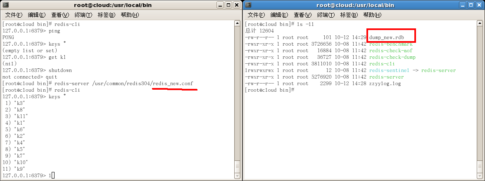   

#### 2. 命令save或者是bgsave   

>**Snapshotting**   
>By default Redis saves snapshots of the dataset on disk, in a binary file called dump.rdb. You can configure Redis to have it save the dataset every N seconds if there are at least M changes in the dataset, or you can manually call the [SAVE](https://redis.io/commands/save) or [BGSAVE](https://redis.io/commands/bgsave) commands.
>
>For example, this configuration will make Redis automatically dump the dataset to disk every 60 seconds if at least 1000 keys changed:
>```
>save 60 1000
>```   
>This strategy is known as snapshotting.
>
>**How it works**   
Whenever Redis needs to dump the dataset to disk, this is what happens:
>* Redis forks. We now have a child and a parent process.
>* The child starts to write the dataset to a temporary RDB file.
>* When the child is done writing the new RDB file, it replaces the old one.
>
>This method allows Redis to benefit from copy-on-write semantics.

**SAVE**：save时只管保存，其它不管，全部阻塞。

**BGSAVE**：Redis会在后台异步进行快照操作，快照同时还可以响应客户端请求。可以通过lastsave命令获取最后一次成功执行快照的时间。

#### 3. 执行flushall命令，也会产生dump.rdb文件，但里面是空的，无意义


<h3 id="3.2.4">3.2.4 如何恢复？如何停止？</h3>

**如何恢复**？   
将备份文件 (dump.rdb) 移动到 redis 安装目录并启动服务即可。

CONFIG GET dir获取目录

**如何停止**？   
动态所有停止RDB保存规则的方法：redis-cli config set save ""

<h3 id="3.2.5">3.2.5 优势、劣势</h3>

**优势**  
* 适合大规模的数据恢复。
* 对数据完整性和一致性要求不高。

**劣势**  
* 在一定间隔时间做一次备份，所以如果redis意外down掉的话，就会丢失最后一次快照后的所有修改。
* fork的时候，内存中的数据被克隆了一份，大致2倍的膨胀性需要考虑

<h3 id="3.2.6">3.2.6 小结</h3>

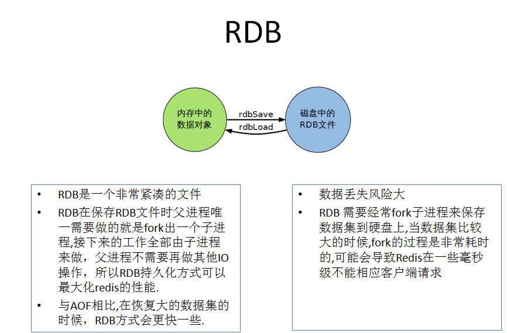


<h2 id="3.3">3.3 AOF(Append Only File)</h2>

<h3 id="3.3.1">3.3.1 官网介绍</h3>

https://redis.io/topics/persistence

>**AOF advantages**   
>* Using AOF Redis is much more durable: you can have different fsync policies: no fsync at all, fsync every second, fsync at every query. With the default policy of fsync every second write performances are still great (fsync is performed using a background thread and the main thread will try hard to perform writes when no fsync is in progress.) but you can only lose one second worth of writes.
>* The AOF log is an append only log, so there are no seeks, nor corruption problems if there is a power outage. Even if the log ends with an half-written command for some reason (disk full or other reasons) the redis-check-aof tool is able to fix it easily.
>* Redis is able to automatically rewrite the AOF in background when it gets too big. The rewrite is completely safe as while Redis continues appending to the old file, a completely new one is produced with the minimal set of operations needed to create the current data set, and once this second file is ready Redis switches the two and starts appending to the new one.
>* AOF contains a log of all the operations one after the other in an easy to understand and parse format. You can even easily export an AOF file. For instance even if you flushed everything for an error using a FLUSHALL command, if no rewrite of the log was performed in the meantime you can still save your data set just stopping the server, removing the latest command, and restarting Redis again.
>**AOF disadvantages**   
>* AOF files are usually bigger than the equivalent RDB files for the same dataset.
>* AOF can be slower than RDB depending on the exact fsync policy. In general with fsync set to every second performance is still very high, and with fsync disabled it should be exactly as fast as RDB even under high load. Still RDB is able to provide more guarantees about the maximum latency even in the case of an huge write load.
>* In the past we experienced rare bugs in specific commands (for instance there was one involving blocking commands like [BRPOPLPUSH](https://redis.io/commands/brpoplpush)) causing the AOF produced to not reproduce exactly the same dataset on reloading. These bugs are rare and we have tests in the test suite creating random complex datasets automatically and reloading them to check everything is fine. However, these kind of bugs are almost impossible with RDB persistence. To make this point more clear: the Redis AOF works by incrementally updating an existing state, like MySQL or MongoDB does, while the RDB snapshotting creates everything from scratch again and again, that is conceptually more robust. However - 1) It should be noted that every time the AOF is rewritten by Redis it is recreated from scratch starting from the actual data contained in the data set, making resistance to bugs stronger compared to an always appending AOF file (or one rewritten reading the old AOF instead of reading the data in memory). 2) We have never had a single report from users about an AOF corruption that was detected in the real world.

<h3 id="3.3.2">3.3.2 是什么？</h3>

* **以日志的形式来记录每个写操作**，将Redis执行过的所有写指令记录下来(读操作不记录)，只许追加文件但不可以改写文件，redis启动之初会读取该文件重新构建数据，换言之，redis重启的话就根据日志文件的内容将写指令从前到后执行一次以完成数据的恢复工作。

* aof保存的是appendonly.aof文件。

* 配置位置   
```
############################## APPEND ONLY MODE ###############################

# By default Redis asynchronously dumps the dataset on disk. This mode is
# good enough in many applications, but an issue with the Redis process or
# a power outage may result into a few minutes of writes lost (depending on
# the configured save points).
#
# The Append Only File is an alternative persistence mode that provides
# much better durability. For instance using the default data fsync policy
# (see later in the config file) Redis can lose just one second of writes in a
# dramatic event like a server power outage, or a single write if something
# wrong with the Redis process itself happens, but the operating system is
# still running correctly.
#
# AOF and RDB persistence can be enabled at the same time without problems.
# If the AOF is enabled on startup Redis will load the AOF, that is the file
# with the better durability guarantees.
#
# Please check http://redis.io/topics/persistence for more information.

appendonly no

# The name of the append only file (default: "appendonly.aof")

appendfilename "appendonly.aof"

```

<h3 id="3.3.3">3.3.3 AOF启动/修复/恢复</h3>

**正常恢复**   
* 启动：设置Yes(修改默认的appendonly no，改为yes)
* 将有数据的aof文件复制一份保存到对应目录(config get dir)
* 恢复：重启redis然后重新加载

**异常恢复**   
* 启动：设置Yes(修改默认的appendonly no，改为yes)
* 备份被写坏的AOF文件
* 修复：redis-check-aof --fix进行修复
* 恢复：重启redis然后重新加载

<p align="center">操作参考</p>

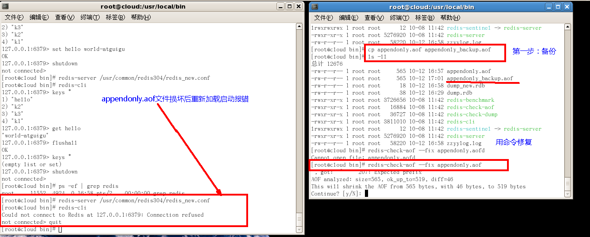


<h3 id="3.3.4">3.3.4 rewrite</h3>

>**Log rewriting**   
>As you can guess, the AOF gets bigger and bigger as write operations are performed. For example, if you are incrementing a counter 100 times, you'll end up with a single key in your dataset containing the final value, but 100 entries in your AOF. 99 of those entries are not needed to rebuild the current state.
>
>So Redis supports an interesting feature: it is able to rebuild the AOF in the background without interrupting service to clients. Whenever you issue a BGREWRITEAOF Redis will write the shortest sequence of commands needed to rebuild the current dataset in memory. If you're using the AOF with Redis 2.2 you'll need to run [BGREWRITEAOF](https://redis.io/commands/bgrewriteaof) from time to time. Redis 2.4 is able to trigger log rewriting automatically (see the 2.4 example configuration file for more information).
>
>**How durable is the append only file?**   
>You can configure how many times Redis will [fsync](http://linux.die.net/man/2/fsync) data on disk. There are three options:
>
>* appendfsync always: fsync every time a new command is appended to the AOF. Very very slow, very safe.
>* appendfsync everysec: fsync every second. Fast enough (in 2.4 likely to be as fast as snapshotting), and you can lose 1 second of data if there is a disaster.
>* appendfsync no: Never fsync, just put your data in the hands of the Operating System. The faster and less safe method. Normally Linux will flush data every 30 seconds with this configuration, but it's up to the kernel exact tuning.
>
>The suggested (and default) policy is to fsync every second. It is both very fast and pretty safe. The always policy is very slow in practice, but it supports group commit, so if there are multiple parallel writes Redis will try to perform a single fsync operation.

#### 是什么？   
AOF采用文件追加方式，文件会越来越大为避免出现此种情况，新增了重写机制,当AOF文件的大小超过所设定的阈值时，Redis就会启动AOF文件的内容压缩，只保留可以恢复数据的最小指令集。可以使用命令bgrewriteaof。

#### 重写原理   
AOF文件持续增长而过大时，会fork出一条新进程来将文件重写(也是先写临时文件最后再rename)，遍历新进程的内存中数据，每条记录有一条的Set语句。重写aof文件的操作，并没有读取旧的aof文件，而是将整个内存中的数据库内容用命令的方式重写了一个新的aof文件，这点和快照有点类似。

#### 触发机制   
**Redis会记录上次重写时的AOF大小，默认配置是当AOF文件大小是上次rewrite后大小的一倍且文件大于64M时触发**。


<h3 id="3.3.5">3.3.5 优势、劣势</h3>

**优势**   
* 每修改同步：appendfsync always 同步持久化 每次发生数据变更会被立即记录到磁盘，性能较差但数据完整性比较好。
* 每秒同步：appendfsync everysec 异步操作，每秒记录，如果一秒内宕机，有数据丢失。
* 不同步：appendfsync no 从不同步。

**劣势**   
* 相同数据集的数据而言aof文件要远大于rdb文件，恢复速度慢于rdb。
* aof运行效率要慢于rdb,每秒同步策略效率较好，不同步效率和rdb相同。

<h3 id="3.3.6">3.3.6 小结</h3>

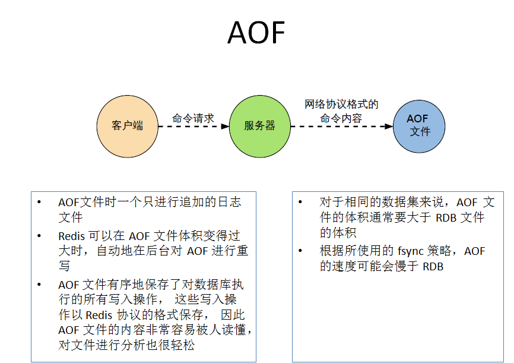


---
<h1 id="4">4. Redis的事务</h1>

---

<h2 id="4.1">4.1 是什么？</h2>

https://redis.io/topics/transactions

**官网介绍**：   
>**Transactions**   
>[MULTI](https://redis.io/commands/multi), [EXEC](https://redis.io/commands/exec), [DISCARD](https://redis.io/commands/discard) and [WATCH](https://redis.io/commands/watch) are the foundation of transactions in Redis. They allow the execution of a group of commands in a single step, with two important guarantees:
>
>* All the commands in a transaction are serialized and executed sequentially. It can never happen that a request issued by another client is served **in the middle of** the execution of a Redis transaction. This guarantees that the commands are executed as a single isolated operation.
>
>* Either all of the commands or none are processed, so a Redis transaction is also atomic. The [EXEC](https://redis.io/commands/exec) command triggers the execution of all the commands in the transaction, so if a client loses the connection to the server in the context of a transaction before calling the [EXEC](https://redis.io/commands/exec) command none of the operations are performed, instead if the [EXEC](https://redis.io/commands/exec) command is called, all the operations are performed. When using the [append-only file](https://redis.io/topics/persistence#append-only-file) Redis makes sure to use a single write(2) syscall to write the transaction on disk. However if the Redis server crashes or is killed by the system administrator in some hard way it is possible that only a partial number of operations are registered. Redis will detect this condition at restart, and will exit with an error. Using the redis-check-aof tool it is possible to fix the append only file that will remove the partial transaction so that the server can start again.
>
>Starting with version 2.2, Redis allows for an extra guarantee to the above two, in the form of optimistic locking in a way very similar to a check-and-set (CAS) operation. This is documented [later](https://redis.io/topics/transactions#cas) on this page.

可以一次执行多个命令，本质是一组命令的集合。一个事务中的所有命令都会序列化，**按顺序地串行化执行而不会被其它命令插入，不许加塞**。

<h2 id="4.2">4.2 能干嘛？</h2>

一个队列中，一次性、顺序性、排他性的执行一系列命令。

<h2 id="4.3">4.3 怎么玩？</h2>

<h3 id="4.3.1">4.3.1 常用命令</h3>

| 命令        | 描述   |
| :-------- | :----- |
|  DISCARD  |  取消事务，放弃执行事务块内的所有命令。  |
|  EXEC  |  执行所有事务块内的命令。  |
|  MULTI  |  标记一个事务块的开始。  |
|  UNWATCH  |  取消 WATCH 命令对所有 key 的监视。  |
|  WATCH key [key ...]  |  监视一个(或多个) key ，如果在事务执行之前这个(或这些) key 被其他命令所改动，那么事务将被打断。  |

<h3 id="4.3.2">4.3.2 CASE</h3>

#### CASE-1 (正常执行)   
```
127.0.0.1:6379> multi
OK
127.0.0.1:6379> set id 12
QUEUED
127.0.0.1:6379> get id
QUEUED
127.0.0.1:6379> incr t1
QUEUED
127.0.0.1:6379> incr t1
QUEUED
127.0.0.1:6379> get t1
QUEUED
127.0.0.1:6379> exec
1) OK
2) "12"
3) (integer) 1
4) (integer) 2
5) "2"
```

#### CASE-2 (放弃事务)   
```
127.0.0.1:6379> multi
OK
127.0.0.1:6379> set name z3
QUEUED
127.0.0.1:6379> set age 30
QUEUED
127.0.0.1:6379> incr t1
QUEUED
127.0.0.1:6379> discard
OK
127.0.0.1:6379> mget name age t1
1) (nil)
2) (nil)
3) "2"
```

#### CASE-3 (全体连坐)   
```
127.0.0.1:6379> multi
OK
127.0.0.1:6379> set name z3
QUEUED
127.0.0.1:6379> get name
QUEUED
127.0.0.1:6379> incr t1
QUEUED
127.0.0.1:6379> set email
(error) ERR wrong number of arguments for 'set' command
127.0.0.1:6379> exec
(error) EXECABORT Transaction discarded because of previous errors.
```

#### CASE-4 (冤头债主)   
```
127.0.0.1:6379> multi
OK
127.0.0.1:6379> set age 30
QUEUED
127.0.0.1:6379> set email abc@163.com
QUEUED
127.0.0.1:6379> incr t1
QUEUED
127.0.0.1:6379> incr email
QUEUED
127.0.0.1:6379> exec
1) OK
2) OK
3) (integer) 3
4) (error) ERR value is not an integer or out of range
127.0.0.1:6379> mget age email t1
1) "30"
2) "abc@163.com"
3) "3"
```

#### CASE-5 (watch监控)   

##### 锁机制   
* **悲观锁**   
悲观锁(Pessimistic Lock), 顾名思义，就是很悲观，每次去拿数据的时候都认为别人会修改，所以每次在拿数据的时候都会上锁，这样别人想拿这个数据就会block直到它拿到锁。传统的关系型数据库里边就用到了很多这种锁机制，比如行锁，表锁等，读锁，写锁等，都是在做操作之前先上锁。

* **乐观锁**   
 乐观锁(Optimistic Lock), 顾名思义，就是很乐观，每次去拿数据的时候都认为别人不会修改，**所以不会上锁**，但是在更新的时候会判断一下在此期间别人有没有去更新这个数据，可以使用版本号等机制。乐观锁适用于多读的应用类型，这样可以提高吞吐量。
 **乐观锁策略:提交版本必须大于记录当前版本才能执行更新**。

* **CAS(Check And Set)**   


##### demo   

1. 初始化信用卡可用余额和欠额
```
127.0.0.1:6379> set balance 100
OK
127.0.0.1:6379> set debt 0
OK
127.0.0.1:6379> multi
OK
127.0.0.1:6379> decrby balance 30
QUEUED
127.0.0.1:6379> incrby debt 30
QUEUED
127.0.0.1:6379> exec
1) (integer) 70
2) (integer) 30
127.0.0.1:6379> mget balance debt
1) "70"
2) "30"
```   

2. 无加塞篡改，先监控再开启multi，保证两笔金额变动在同一个事务内
```
127.0.0.1:6379> watch balance
OK
127.0.0.1:6379> multi
OK
127.0.0.1:6379> decrby balance 10
QUEUED
127.0.0.1:6379> incrby debt 10
QUEUED
127.0.0.1:6379> exec
1) (integer) 60
2) (integer) 40
127.0.0.1:6379> mget balance debt
1) "60"
2) "40"
```   

3. 有加塞篡改，监控了key，如果key被修改了，后面一个事务的执行失效
```
127.0.0.1:6379> watch balance
OK
127.0.0.1:6379> set balance 300
OK
127.0.0.1:6379> multi
OK
127.0.0.1:6379> decrby balance 15
QUEUED
127.0.0.1:6379> incrby debt 15
QUEUED
127.0.0.1:6379> mget balance debt
QUEUED
127.0.0.1:6379> exec
(nil)
127.0.0.1:6379> mget balance debt
1) "300"
2) "40"
```   

4. unwatch
```
127.0.0.1:6379> mget balance debt
1) "300"
2) "40"
127.0.0.1:6379> watch balance
OK
127.0.0.1:6379> set balance 350
OK
127.0.0.1:6379> set debt 0
OK
127.0.0.1:6379> unwatch
OK
127.0.0.1:6379> mget balance debt
1) "350"
2) "0"
127.0.0.1:6379> multi
OK
127.0.0.1:6379> decrby balance 150
QUEUED
127.0.0.1:6379> incrby debt 150
QUEUED
127.0.0.1:6379> mget balance debt
QUEUED
127.0.0.1:6379> exec
1) (integer) 200
2) (integer) 150
3) 1) "200"
   2) "150"
127.0.0.1:6379> mget balance debt
1) "200"
2) "150"
```

5. 一旦执行了exec之前加的监控锁都会被取消掉了


##### 小结   
* Watch指令，类似乐观锁，事务提交时，如果Key的值已被别的客户端改变，比如某个list已被别的客户端push/pop过了，整个事务队列都不会被执行。
* 通过WATCH命令在事务执行之前监控了多个Keys，倘若在WATCH之后有任何Key的值发生了变化，EXEC命令执行的事务都将被放弃，同时返回Nullmulti-bulk应答以通知调用者事务执行失败。


<h2 id="4.4">4.4 三阶段</h2>

1. **开启**：以MULTI开始一个事务；
2. **入队**：将多个命令入队到事务中，接到这些命令并不会立即执行，而是放到等待执行的事务队列里面；
3. **执行**：由EXEC命令触发事务。

<h2 id="4.5">4.5 三特性</h2>

1. **单独的隔离操作**：事务中的所有命令都会序列化、按顺序地执行。事务在执行的过程中，不会被其他客户端发送来的命令请求所打断。
2. **没有隔离级别的概念**：队列中的命令没有提交之前都不会实际的被执行，因为事务提交前任何指令都不会被实际执行，也就不存在”事务内的查询要看到事务里的更新，在事务外查询不能看到”这个让人万分头痛的问题。
3. **不保证原子性**：redis同一个事务中如果有一条命令执行失败，其后的命令仍然会被执行，没有回滚。


---
<h1 id="5">5. Redis的发布订阅</h1>

---

<h2 id="5.1">5.1 是什么？</h2>

https://redis.io/topics/pubsub

**Redis 发布订阅(pub/sub)是一种消息通信模式：发送者(pub)发送消息，订阅者(sub)接收消息。**

**Redis 客户端可以订阅任意数量的频道**。


<p align="center">订阅/发布消息图</p>

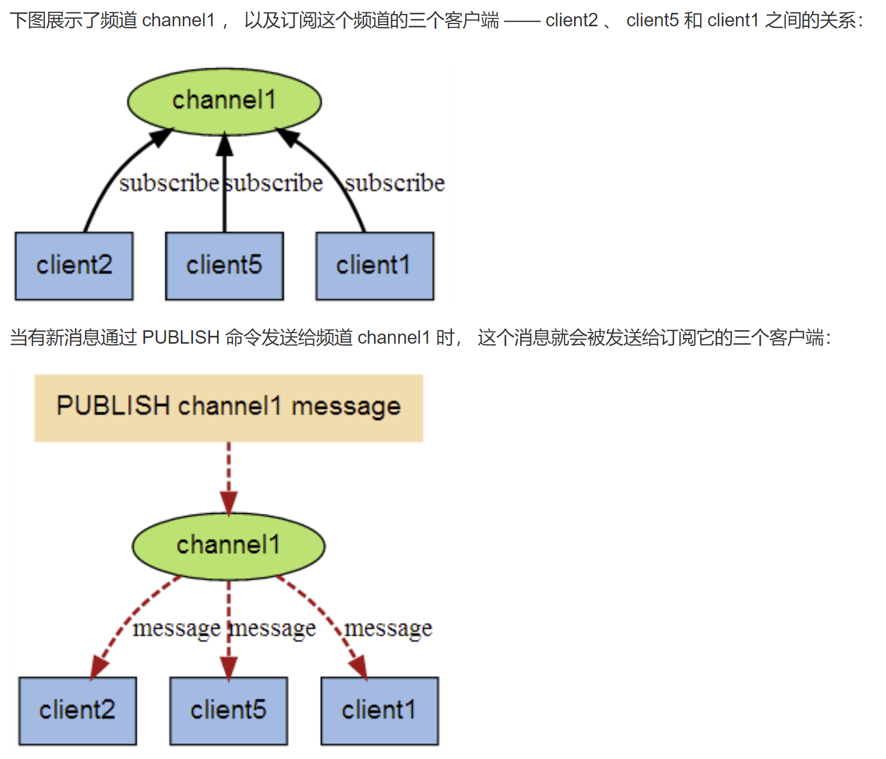

<h2 id="5.2">5.2 命令</h2>

| 命令        | 描述   |
| :-------- | :----- |
|  PSUBSCRIBE pattern [pattern ...]  |  取消事务，放弃执行事务块内的所有命令。  |
|  PUBSUB subcommand [argument [argument ...]]  |  查看订阅与发布系统状态。  |
|  PUBLISH channel message  |  将信息发送到指定的频道。  |
|  PUNSUBSCRIBE [pattern [pattern ...]]  |  退订所有给定模式的频道。  |
|  SUBSCRIBE channel [channel ...]  |  订阅给定的一个或多个频道的信息。  |
|  	UNSUBSCRIBE [channel [channel ...]]  |  指退订给定的频道。  |

<h2 id="5.3">5.3 案列</h2>

以下实例演示了发布订阅是如何工作的。在我们实例中我们创建了订阅频道名为 redisChat:
```
redis 127.0.0.1:6379> SUBSCRIBE redisChat

Reading messages... (press Ctrl-C to quit)
1) "subscribe"
2) "redisChat"
3) (integer) 1
```

现在，我们先重新开启个 redis 客户端，然后在同一个频道 redisChat 发布两次消息，订阅者就能接收到消息。
```
redis 127.0.0.1:6379> PUBLISH redisChat "Redis is a great caching technique"

(integer) 1

redis 127.0.0.1:6379> PUBLISH redisChat "Learn redis by runoob.com"

(integer) 1

# 订阅者的客户端会显示如下消息
1) "message"
2) "redisChat"
3) "Redis is a great caching technique"
1) "message"
2) "redisChat"
3) "Learn redis by runoob.com"
```


---
<h1 id="6">6. Redis Replication</h1>

---

<h2 id="6.1">6.1 是什么？</h2>

https://redis.io/topics/replication

>**Replication**
>
>The following are some very important facts about Redis replication:
>
>* Redis uses asynchronous replication, with asynchronous replica-to-master acknowledges of the amount of data processed.
>* A master can have multiple replicas.
>* Replicas are able to accept connections from other replicas. Aside from connecting a number of replicas to the same master, replicas can also be connected to other replicas in a cascading-like structure. Since Redis 4.0, all the sub-replicas will receive exactly the same replication stream from the master.
>* Redis replication is non-blocking on the master side. This means that the master will continue to handle queries when one or more replicas perform the initial synchronization or a partial resynchronization.
>* Replication is also largely non-blocking on the replica side. While the replica is performing the initial synchronization, it can handle queries using the old version of the dataset, assuming you configured Redis to do so in redis.conf. Otherwise, you can configure Redis replicas to return an error to clients if the replication stream is down. However, after the initial sync, the old dataset must be deleted and the new one must be loaded. The replica will block incoming connections during this brief window (that can be as long as many seconds for very large datasets). Since Redis 4.0 it is possible to configure Redis so that the deletion of the old data set happens in a different thread, however loading the new initial dataset will still happen in the main thread and block the replica.
>* Replication can be used both for scalability, in order to have multiple replicas for read-only queries (for example, slow O(N) operations can be offloaded to replicas), or simply for improving data safety and high availability.
>* It is possible to use replication to avoid the cost of having the master writing the full dataset to disk: a typical technique involves configuring your master redis.conf to avoid persisting to disk at all, then connect a replica configured to save from time to time, or with AOF enabled. However this setup must be handled with care, since a restarting master will start with an empty dataset: if the replica tries to synchronized with it, the replica will be emptied as well.

**行话**：也就是我们所说的主从复制，主机数据更新后根据配置和策略，自动同步到备机的master/slaver机制，Master以写为主，Slave以读为主。

<h2 id="6.2">6.2 能干嘛？</h2>

* 读写分离
* 容灾恢复

<h2 id="6.3">6.3 怎么玩？</h2>

### 6.3.1 配从(库)不配主(库)

### 6.3.2 从库配置：slaveof 主库IP 主库端口

* 每次与master断开之后，都需要重新连接，除非你配置进redis.conf文件
* info replication

### 6.3.3 修改配置文件细节操作

1. 拷贝多个redis.conf文件

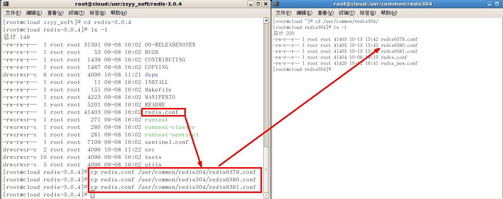   

2. 开启daemonize yes

3. pid文件名字

4. log文件名字
```
################################# GENERAL #####################################

# By default Redis does not run as a daemon. Use 'yes' if you need it.
# Note that Redis will write a pid file in /var/run/redis.pid when daemonized.
daemonize yes

# ...

# Creating a pid file is best effort: if Redis is not able to create it
# nothing bad happens, the server will start and run normally.
pidfile /var/run/redis_6379.pid

# ...

# Specify the log file name. Also the empty string can be used to force
# Redis to log on the standard output. Note that if you use standard
# output for logging but daemonize, logs will be sent to /dev/null
logfile "mylog6379.log"

```

5. 指定端口
```
################################## NETWORK #####################################

# ...

# Accept connections on the specified port, default is 6379 (IANA #815344).
# If port 0 is specified Redis will not listen on a TCP socket.
port 6379
```

6. dump.rdb名字
```
################################ SNAPSHOTTING  ################################
#
# Save the DB on disk:
#
...

# The filename where to dump the DB
dbfilename dump.rdb
```

### 6.3.4 常用3招

#### 6.3.4.1 一主二仆

1. init   
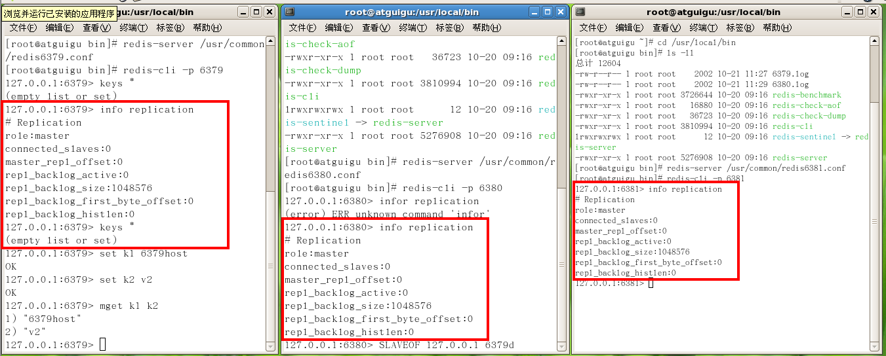   

2. 一个Master两个Slave   
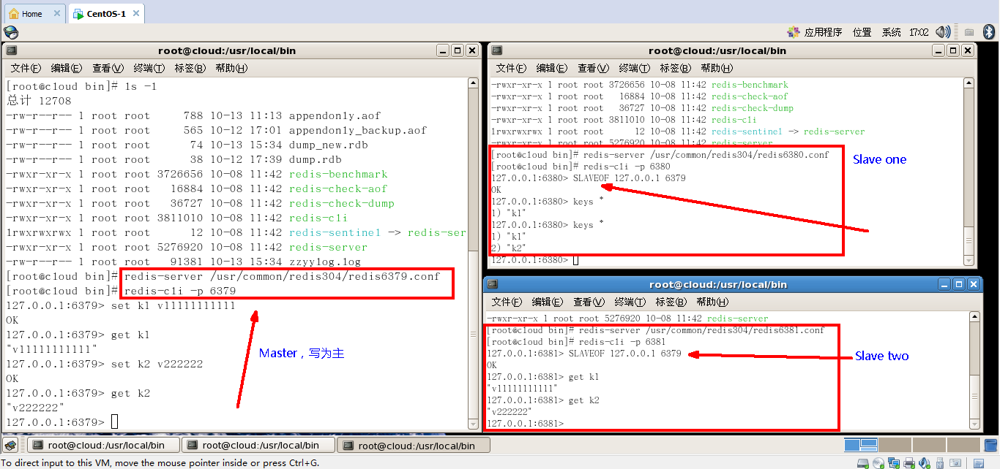   

3. 日志查看   
* 主机日志   
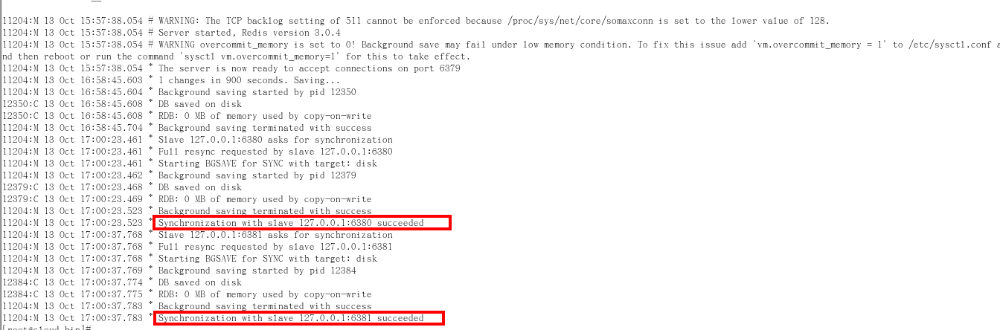   

* 备机日志   
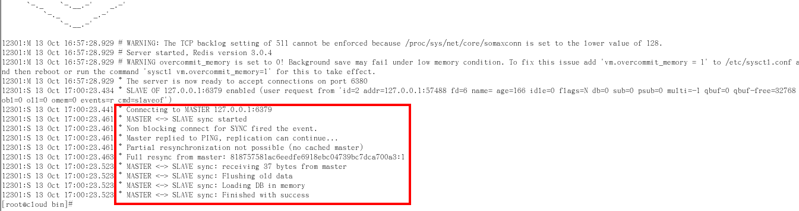   

* info replication   
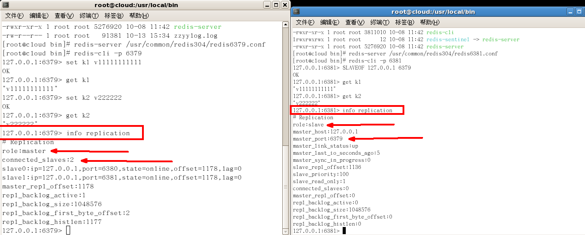   

4. 主从问题演示    
* 切入点问题？slave1、slave2是从头开始复制还是从切入点开始复制?比如从k4进来，那之前的123是否也可以复制

* 从机是否可以写？set可否？

* 主机shutdown后情况如何？从机是上位还是原地待命

* 主机又回来了后，主机新增记录，从机还能否顺利复制？

* 其中一台从机down后情况如何？依照原有它能跟上大部队吗？

#### 6.3.4.2 薪火相传

* 上一个Slave可以是下一个slave的Master，Slave同样可以接收其他slaves的连接和同步请求，那么该slave作为了链条中下一个的master,可以有效减轻master的写压力。
* 中途变更转向:会清除之前的数据，重新建立拷贝最新的。
* slaveof 新主库IP 新主库端口。

#### 6.3.4.3 反客为主

SLAVEOF no one

使当前数据库停止与其他数据库的同步，转成主数据库


<h2 id="6.4">6.4 复制原理</h2>

1. slave启动成功连接到master后会发送一个sync命令；
2. Master接到命令启动后台的存盘进程，同时收集所有接收到的用于修改数据集命令，在后台进程执行完毕之后，master将传送整个数据文件到slave,以完成一次完全同步；
3. 全量复制：而slave服务在接收到数据库文件数据后，将其存盘并加载到内存中；
4. 增量复制：Master继续将新的所有收集到的修改命令依次传给slave,完成同步；
5. 但是只要是重新连接master,一次完全同步（全量复制)将被自动执行。


<h2 id="6.5">6.5 哨兵模式(sentinel)</h2>

<h3 id="6.5.1">6.5.1 是什么？</h3>

反客为主的自动版，能够后台监控主机是否故障，如果故障了根据投票数自动将从库转换为主库。

一组sentinel能同时监控多个Master。

<h3 id="6.5.2">6.5.2 怎么玩(使用步骤)？</h3>

#### 1. 调整结构，6379带着80、81

#### 2. 自定义的/myredis目录下新建sentinel.conf文件，名字绝不能错

#### 3. 配置哨兵,填写内容

sentinel monitor 被监控数据库名字(自己起名字) 127.0.0.1 6379 1   
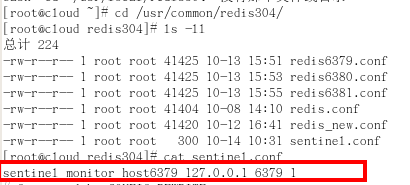   
上面最后一个数字1，表示主机挂掉后salve投票看让谁接替成为主机，得票数多少后成为主机。

#### 4. 启动哨兵
```
redis-sentinel /myredis/sentinel.conf
```

上述目录依照各自的实际情况配置，可能目录不同

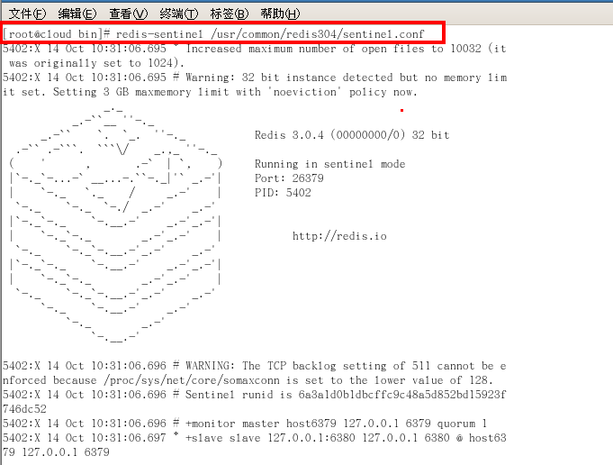   

#### 5. 正常主从演示

#### 6. 原有的master挂了
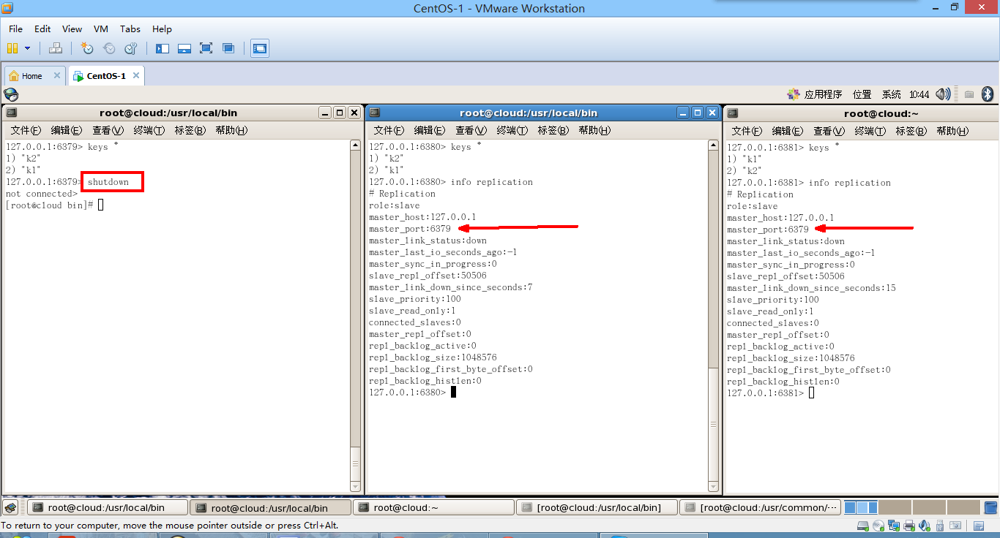   

#### 7. 投票新选
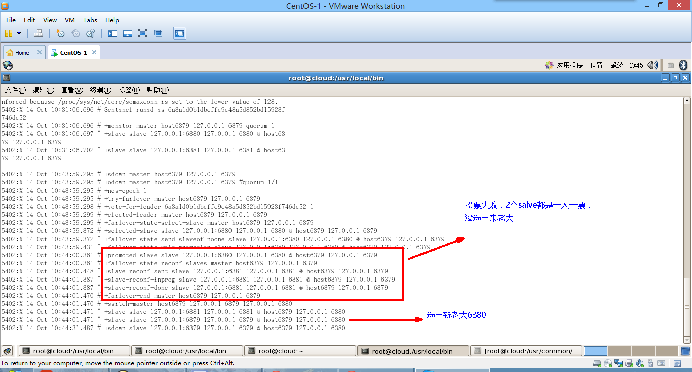   

#### 8. 重新主从继续开工,info replication查查看
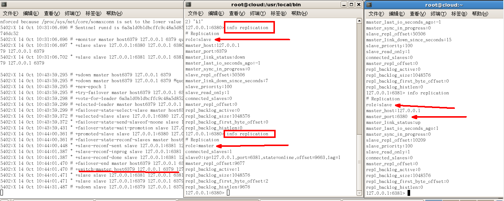   

#### 9. 问题：如果之前的master重启回来，会不会双master冲突？
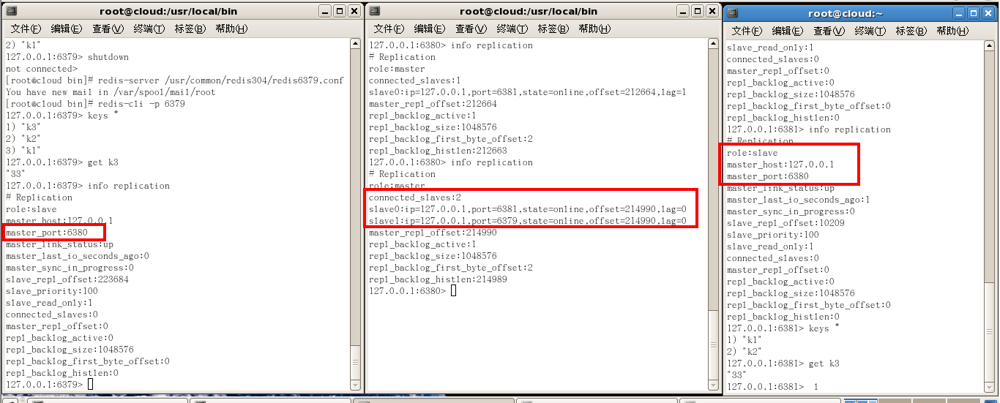   

<h3 id="6.6">6.6 复制的缺点</h3>

**复制延时**：   
由于所有的写操作都是先在Master上操作，然后同步更新到Slave上，所以从Master同步到Slave机器有一定的延迟，当系统很繁忙的时候，延迟问题会更加严重，Slave机器数量的增加也会使这个问题更加严重。


